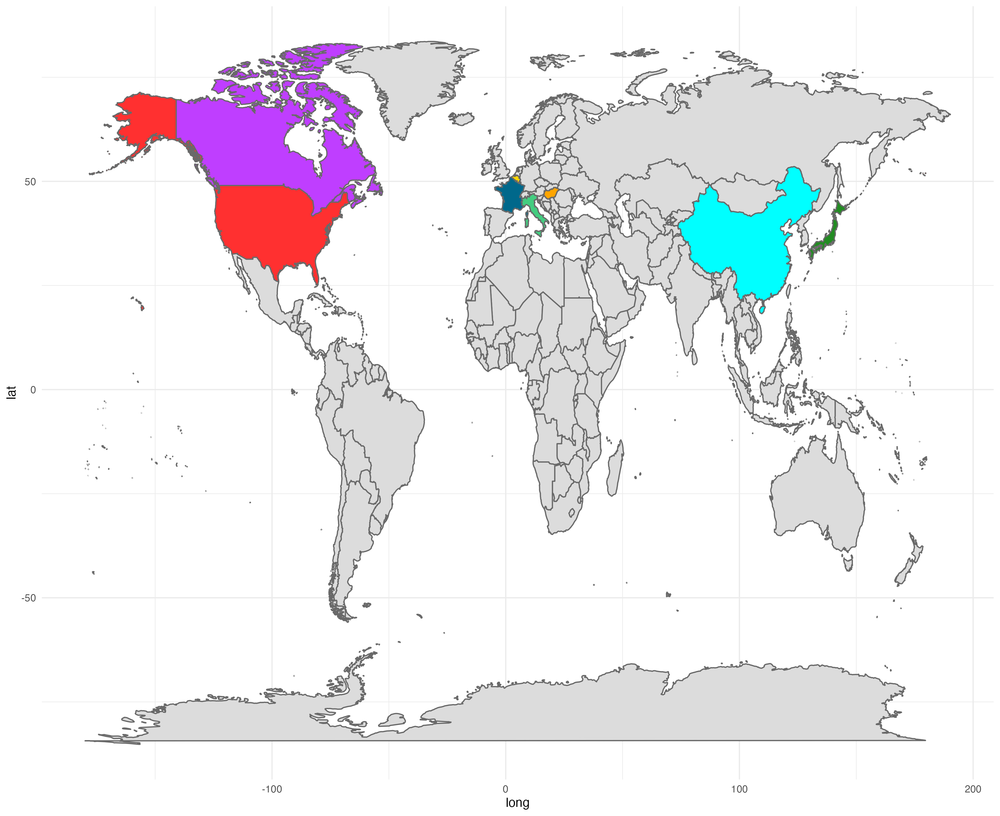
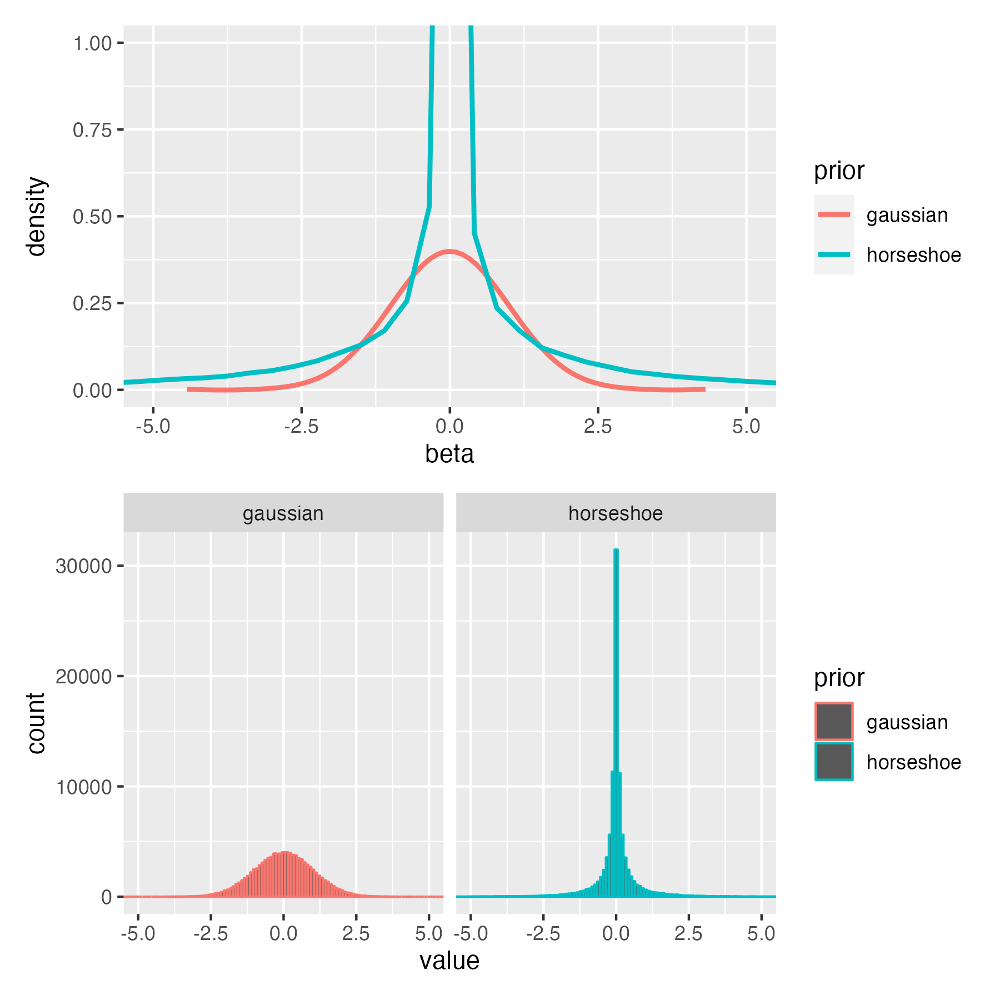
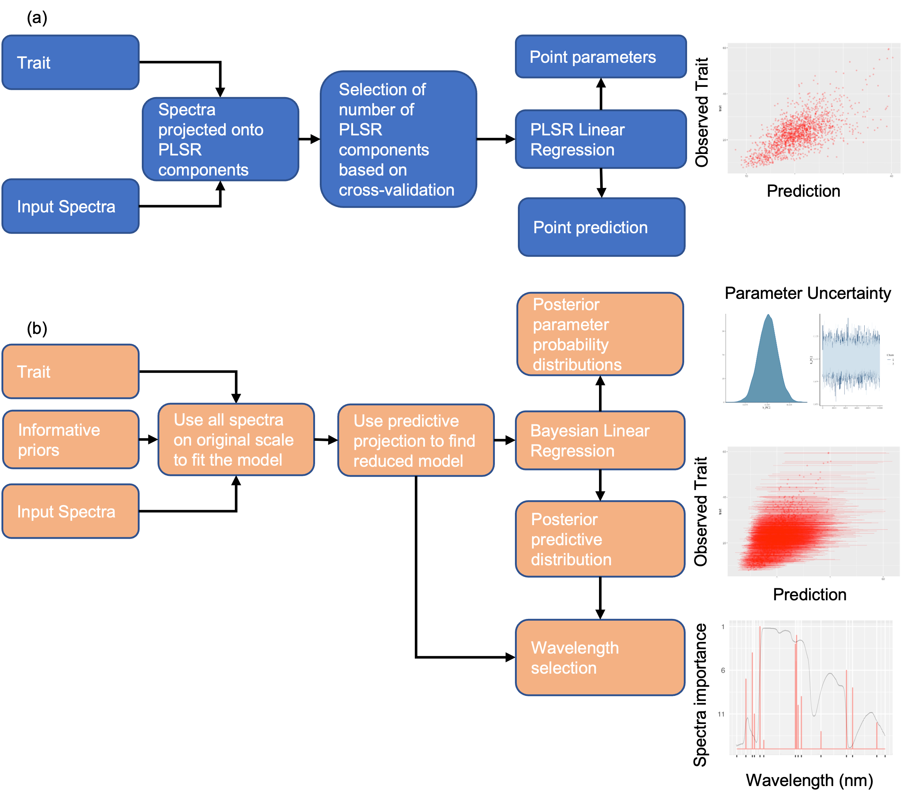
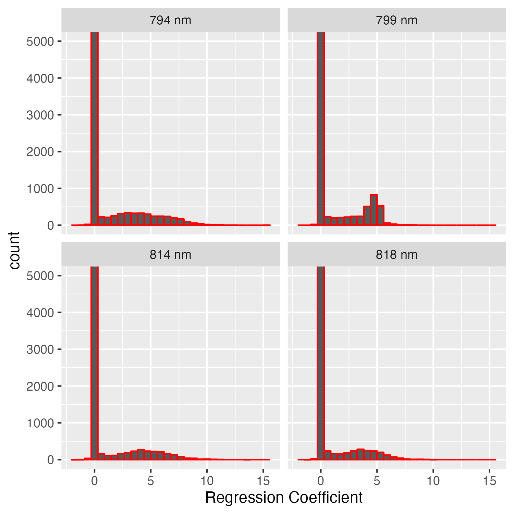
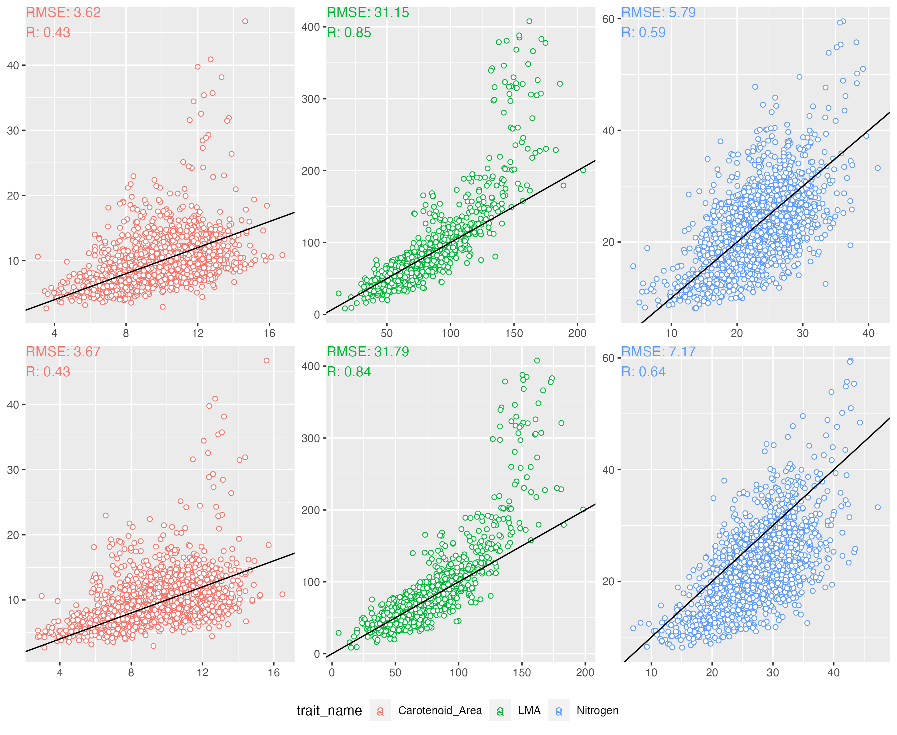
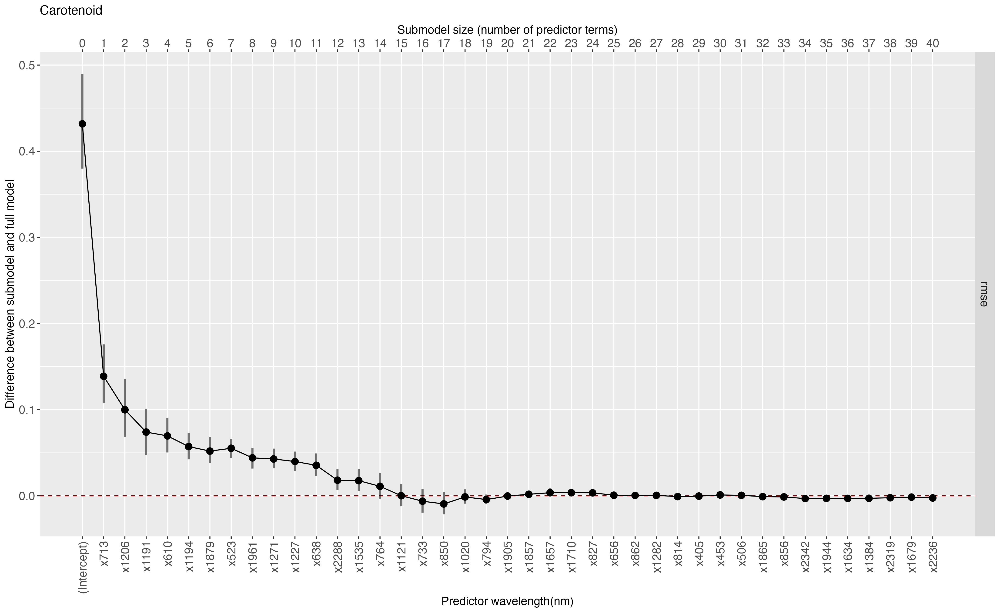
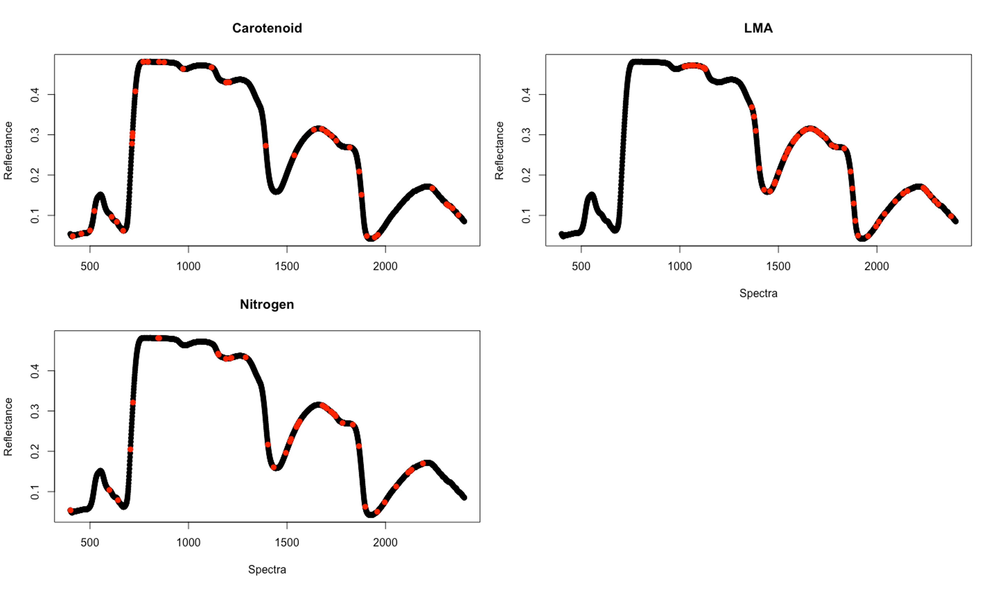
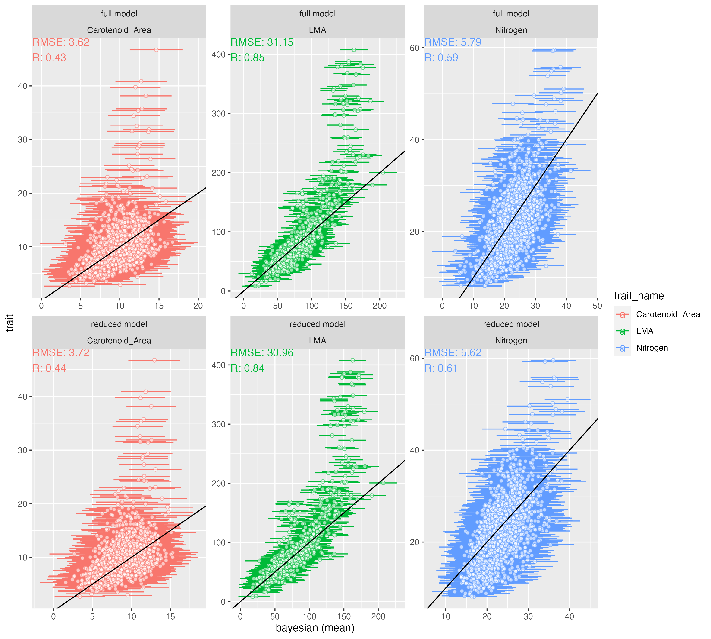
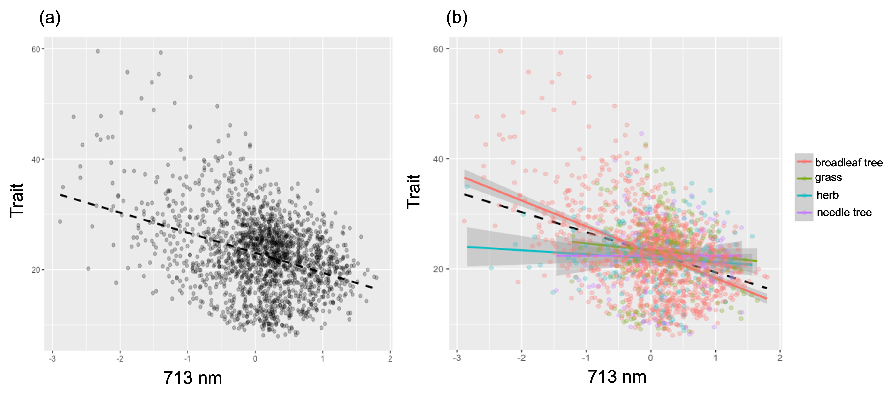

<!-- TODO: Abstract -->

# Introduction

```{r}
#| echo: FALSE
# TODO: You can add other trait names from Roamresearch I.2-Paper-2
```

Foliar Functional traits are chemical (such as chlorophyll), physiological (such as photosynthetic rate) and structural (such as leaf area) features of a leaf which mediate ecosystem functioning and its response to perturbations by regulating the growth fitness of plants in diverse ecosystems [@serbin2020; @lavorel2002; @wright2005; @funk2017]. In an ecosystem, foliar functional traits influence the resource allocation and reallocation of resources by a plant under diverse environmental conditions [@reich2014; @wang2020] and affect the functional diversity driving ecosystem productivity [@cadotte2009]. Foliar traits are also important parameters in dynamic vegetation and Earth System models, and uncertainty and variability in foliar traits is a major source of uncertainty in model predictions of ecosystem composition and function [@wullschleger2014; @friedlingstein2006; @shiklomanovStructureParameterUncertainty2020]. The National Academy of Sciences 2017 Decadal Survey specifically identifies the spatio-temporal distribution of plant functional traits as a crucial objective (E-1a). It is not surprising that plant functional traits are identified as an Essential Biodiversity Variable (@pereira2013, @pettorelli2016).

Leaf-level measurements of light reflectance and absorption has been used to quantify leaf pigments and leaf structure since the early 1900's [@serbin2020; @cotrozziReflectanceSpectroscopyNovel2018] with important early papers by @shull1929, @mcnicholasVisibleUltravioletAbsorption1931, @rabideauAbsorptionReflectionSpectra1946, @clark1946, @krinovSpectralReflectanceProperties1947 and @gates1965. The past two decades has witnessed an increased application of a wide variety of retrieval algorithms to quantify different vegetation characteristics -- including plant function traits-- using hyperspectral data (see @verrelst2019 for a review).

Broadly, traits are predicted using reflectance spectra using two approaches: physically-based methods and empirical algorithms. The empirical approach has been the dominant method of predicting traits using spectra due to (a) ease in application, (b) higher accuracy than physically-based methods, and (c) ability to be applied on a wide range of traits [@wang2019]. Among empirical methods, the Partial Least Squares Regression (PLSR) [@wold1984] Random Forest [@pullanagari2016], Neural Networks [@huang2004; @cherif2023] , Gaussian Process Regression [@wang2019], etc., have shown considerable promise. Among these approaches, only Gaussian Process Regression allows rigorous uncertainty quantification but it is computationally expensive and lacks interpretability.

The PLSR remains the most widely used empirical approach for predicting a wide variety of traits (e.g., @verrelst2019; @coops2003; @hansen2003; @serbinArcticTropicsMultibiome2019) due to its ease of use, computational efficiency and its ability to handle predictor (reflectance wavelengths for our study) collinearity. This is because PLSR transforms the input predictors into a handful of orthogonal latent components [@wold1984] and hence can be applied even when the number of predictors is greater than the number of training observations. The PLSR approach, however, comes with its own set of shortcomings. Chiefly, the PLSR approach to trait estimation does not provide rigorous uncertainty estimates but instead rely on bootstrapping which can lead to inaccurate confidence intervals for small to medium datasets [@chernick2009; @hesterberg2015]. PLSR approaches also cannot account for the hierarchical structure that might exist in certain traits and is hence challenged by the variability of the relationship between traits and spectra across species, functional types, and biomes. This problem can be especially acute for undersampled species.

::: content-hidden
Another drawback of the PLSR approach is that it assumes a linear relationship between the traits and spectra. Though there have been a few applications of kernel based PLSR approaches for trait prediction (e.g. @arenas-garcia2008), the majority of the studies still use the standard PLSR assuming a linear relationship between the traits and spectra.
<!-- [Alexey] This is an important point. I suggest including this in the discussion. -->
:::

To account for certain shortcomings of PLSR (and other empirical approaches), Bayesian regression methods are an attractive alternative. Bayesian methods provide rich uncertainty quantification and are easily amenable to more complex models such as hierarchical Bayesian models which can account site-specific, group-specific (such as PFT level, species level effects), easily integrate within physical models, and account for measurement errors of different instruments as well. Bayesian statistical methods have also been successfully used in accounting for change of scale measurements from point scale to satellite scale in different environmental domains. Bayesian methods can incorporate information from secondary sources such as radiative transfer models and/or expert opinion in the form of prior distributions and can be a useful tool in the recent push for hybrid physical-machine learning approaches.

The objective of this paper is to present a computationally efficient Bayesian framework that estimates traits directly from reflectance spectra (without any latent transformation) while propagating uncertainties in a rigorous fashion. To achieve this, we use a special class of shrinkage priors which allow us to use Bayesian regression with high-dimensional correlated hyperspectral data while preventing overfitting. To improve the computational efficiency of the Bayesian algorithm, we apply a predictive projection technique [@juhopiironenProjectiveInferenceHighdimensional2020] which projects the full Bayesian model to a reduced model with a handful of input wavelengths while preserving predictive accuracy. This technique is different in the sense that the selection of the relevant wavelengths is done based on the Bayesian model (which has an error term) instead of directly using the noisy trait observations for selecting the variables. Past studies have shown even if the true error structure of the data is not known, model reduction techniques such as the above outperforms variable selection methods directly applied to (noisy) observations <!--# add citations-->.

We also discuss how the Bayesian framework can be easily extended to.... which will potentially open a previously unexplored research territory of exploring the relationships between spectra and traits beyond finding global relationships between the two.

# Methods

## Study Area and Data

To assess the feasibility of the proposed Bayesian method, we use paired observations of spectra and traits for three foliar traits: carotenoid ( $Car_{area}$; area basis), Nitrogen ($N{mass}$; mass basis) and Leaf Mass per Area (LMA) paired with hyperspectral reflectance data from 400 nm to 2400 nm from publicly available Ecological Spectral Information System (EcoSIS) library (citation needed). LMA influences leaf longevity, light interception by leaves and effects photosynthetic productivity [@wright2004; @díaz2016; @reich2014; @wang2019; @cherif2023]. Leaf Nitrogen regulates plant photosynthetic rate -- most importantly through ribulose-1,5-bisphosphate carboxylase/oxygenase (Rubisco) -- and is useful to parameterize photosynthetic processes in ecosystem models [@evansPhotosynthesisNitrogenRelationships1989; @evansNitrogenCostPhotosynthesis2019]. Carotenoids are leaf pigments crucial for photosynthesis, photooxidative protection, pigmentation and phytohormone synthesis [@armstrongCarotenoidsGeneticsMolecular1996; @maokaCarotenoidsNaturalFunctional2020; @sunPlantCarotenoidsRecent2022] . Carotenoid derived compounds affect the flavor and aroma of crops as well as development of defense-related plant compounds [@simkinCarotenoidsApocarotenoidsPlanta2021] .

The observations span a wide range of climatic and geographic range ( @fig-studyarea) though the majority of the observations are from North America. The number of training observations for the three traits vary significantly across the three traits (carotenoid: 394, nitrogen: 541, LMA: 5934) which aid in showing the accuracy of the algorithm across different training sizes.

```{r studyarea}
#| echo: FALSE
#| label: fig-studyarea
#| fig-cap: "Study Area"
#source("R_codes/Plotting/world_map_with_countries_used_highlighted.R")
```

{#fig-studyarea}

## Data Processing

We downloaded and processed all spectra and trait data from EcoSIS so that they have the same units across datasets. We took only those data which have all the reflectance spectral wavelengths available from 400 nm-2400 nm at a spectral resolution of 1 nm. Since the trait units are different across study areas, the traits are converted to common units; carotenoid : $\mu g/cm^{2}$, nitrogen : ($mg/g$) and LMA : $g/m^{2}$.

To avoid replication of effort in acquiring trait datasets from the ECOSIS website, the entire workflow and associated R scripts for downloading the data from the ECOSIS website and compiling/processing the data to user-defined units is given here <!--# add hyperlink to Github page --> .

## Model description

In this section, we first describe the Bayesian regression model used in predicting traits using hyperspectral data. Formulating appropriate priors is essential for high dimensional problems (where number of input spectral bands is large) to avoid overfitting; thus we also define the relevant priors used in the current work. To enable computationally efficient prediction on new data while maintaining the predictive capabilities of the Bayesian model, we project the Bayesian model to a simpler model using projective inference [@juhopiironenProjectiveInferenceHighdimensional2020]. As opposed to the full Bayesian model, the projected model requires only a subset of input spectra thus drastically improving computational speed and facilitating interpretation.

Notationally, we denote a scalar with a lower case letter and a vector with bold lower case letter. Superscript $T$ refers to transpose. All vectors are assumed to be column vectors.

### Full Bayesian regression model {#sec-full_bayesian_model}

Let the trait to be predicted be defined as a random variable $y$. For an $i^{th}$ observation, let the measured trait value be defined as $y_i$ and the corresponding input (intercept plus) hyperspectral wavelength be defined as the vector $\boldsymbol{x_i} = (1, x_{i,400}, x_{i,401}, ..., x_{i,2399}, x_{i,2400})$. We assume that $y_i$ is a linear function of $\boldsymbol{x}$ such that:

$$
y_i = \boldsymbol{\beta}^T \boldsymbol{x_i} + \epsilon_i, \; \epsilon \sim N(0, \sigma^2), \; i = 1,..., n
$$ {#eq-linear_model}

where $n$ is the number of observations.\
Here the length of $x_i$ is the number of input wavelengths (400 nm - 2400 nm), $p = 2001$ plus intercept. $\boldsymbol{\beta}$ denotes the (column) vector of corresponding regression coefficients for $\boldsymbol{x_i}$, and $\sigma^2$ is the noise variance. We can also write @eq-linear_model as a multivariate normal distribution of size $n$:

$$
p(Y|\beta, \sigma^2)  = N_n(X\beta, \sigma^2I)
$$ {#eq-linear_model_probability}

where $Y = (y_1, y_2, .., y_n)$ is a vector of n trait observations and $X$ is the corresponding $n \times (p + 1)$ matrix of input wavelengths, \$I\$ is an identity matrix of size $n$. Let the training data for the regression model i.e. $n$ paired observations of trait and spectra be denoted by $\mathcal{D}$.

#### Formulating priors

An important component of the Bayesian approach is to formulate appropriate priors for the parameter vector $\boldsymbol{\theta} :=(\boldsymbol{\beta}, \sigma^{2})$ used in the model. A prior distribution represents our belief about these parameters and their uncertainty prior to observing the training data $\mathcal{D}$. In this work, we start with the prior belief that a trait is sensitive only to a subset of the wavelengths. This prior belief makes sense because functional traits have been shown to be sensitive to particular wavelengths in the VSWIR region. Additionally, since the dimension of $\boldsymbol{\beta}$ (2002) is large and the available measured trait data is generally sparse, using traditionally used priors for $\boldsymbol{\beta}$ (such as normally distributed priors) can lead to over-fitting of the Bayesian model. This is especially true when the number of observations in $\mathcal{D}$ is less than or comparable to $p + 1$.\

Since, a given trait is assumed to be sensitive to a subset of the wavelengths, we need a prior distribution which shrinks the $\beta$ coefficients of the non-important wavelengths (with respect to the analyzed trait) to zero while letting the regression coefficients of the important wavelengths escape this shrinkage. Such a prior distribution should therefore assign a high probability density at zero while also have heavy-tail i.e. having non-trivial probabilities for large values of $\beta$ ( which allows the modeling of large values of $\beta$) for important wavelengths. To achieve this, we use a special prior distribution called the regularized horseshoe prior [@piironen2017]. The regularized horseshoe prior belongs to a class of priors called shrinkage or sparsifiying priors which shrink $\beta$ coefficients of the non-important wavelengths to zero and also have heavy-tails. The regularized horseshoe is an extension of the horseshoe prior [@carvalho2010] which has been widely used in high-dimensional regression because of its good theoretical properties and practical applications [@datta2013; @pas2014; @piironen2017; @vanerpShrinkagePriorsBayesian2019]. For $j^{th}$ regresssion coefficient $\beta_j$, the regularized horsehoe prior is defined as:

$$
\begin{aligned}
& \beta_j|\tilde{\lambda_j}, \tau \sim N(0, \tau^2 \hat{\lambda_j}^2),  \; \tilde{\lambda_j^2} = \frac{c^2 \lambda_j^2}{c^2 + \tau^2 \lambda_j^2} \\
& \lambda_j \sim C^+(0, 1) \text{for } j = 1, ..., D \\
& c^2 \sim IG(\nu /2, \nu s^2/2) \\
& \tau^2 \sim C^+(0, \tau_0^2), \; \tau_0^2 = \frac{p_0}{p - p_0} \sigma \\
\end{aligned}
$$ {#eq-horseshoe}

where $C^+$ is a standard half-Cauchy distribution on the positive reals, IG is the inverse-Gamma distribution and $p_0$ is our prior crude guess on how many non-zero coefficients are there for the model . For our analysis, we set $\frac{p_0}{D-p_0}$ as 0.025 for all the traits, denoting our a-priori guess that around 50 wavelengths are important for predicting a particular trait. Better a-priori guesses for individual traits can be set by consulting past literature but we avoid it to maintain generality of the proposed approach. We fix $\nu = 4$ and $s = 2$ following [@piironen2017].\
\
The $\tau$ parameter in regularized horseshoe prior (@eq-horseshoe) drives all regression coefficients to zero while the thick Cauchy-tails for $\lambda_j$ allow some of the regression coefficients (of important wavelengths) to escape this shrinkage towards zero.\
The regularized horsehoe has an extra parameter $c$ which better penalizes the non-shrinkage coefficients (i.e. the regression coefficients that are not equal to zero) compared to the original horseshoe prior. This helps if the regression coefficients are weakly identified (which can happen if the input wavelengths are highly correlated) and also improves the sampling robustness during posterior parameter inference using Markov Chain Monte Carlo (MCMC) methods [@piironen2017] . Note that the regularized horseshoe prior does not make the shrunk $\beta$ coefficients exactly zero, but "pulls" them towards zero.\

@fig-method_horseshoe_vs_gaussian gives the comparison between the regularized horseshoe prior and the Gaussian prior by simulating 500 samples for a regression coefficient \$\\beta_j\$ following @eq-horseshoe and from a Gaussian distribution with mean 0 and standard deviation 0.05. The horseshoe prior assigns a significantly higher probability at zero leading to better shrinkage of regression coefficients towards zero for non-important wavelengths. It also has a heavier tail than the Gaussian distribution allowing larger values for the beta coefficients for important wavelengths. For the intercept term in $\beta$ and the error variance $\sigma^2$ in the model, we use an improper flat prior in the brms package denoting uniformative priors.

{#fig-method_horseshoe_vs_gaussian}

```{r horseshoe}
#| echo: FALSE
# Uncomment below if you want to plot the horseshoe vs gaussian prior simulations

# library(extraDistr)
# library(ggplot2)
# m_eff <- 0.05
# nu <- 4
# s = 2
# n_sim <- 100000
# 
# set.seed(100)
# # simulating from regularized horseshoe
# beta_j <- density_j <-  vector()
# for(i in 1: n_sim)
# {
#   sigma = 1
#   tau_0_sq <- m_eff *sigma
#   tau_sq <- rhcauchy(n = 1, sigma = tau_0_sq)
# 
#   lambda_j <- rhcauchy(n = 1, sigma = 1)
# 
#   alpha = nu/2; beta <- (nu *s^2)/2
#   c_sq <- rinvgamma(n = 1, alpha = alpha, beta = beta)
# 
#   lambda_j_tilde_sq <- (c_sq * lambda_j^2)/(c_sq + tau_sq *lambda_j^2)
#   beta_j[i] <- rnorm(1, mean = 0, sd = sqrt(tau_sq * lambda_j_tilde_sq))
#   density_j[i] <- dnorm(beta_j[i], mean = 0, sd = sqrt(tau_sq * lambda_j_tilde_sq))
# }
# hist(beta_j, 1e4, freq = FALSE, col = "red")
# # simulating from normal distribution
# 
# sigma = 1
# beta_j_normal <- rnorm(n_sim, mean = 0, sd = sigma)
# density_j_normal <- dnorm(beta_j_normal, mean = 0, sd = sigma)
# hist(beta_j_normal, 1e4, freq = FALSE, col = "red")
# 
# ##make plot using ggplot
# 
# beta_df <- data.frame(value =  c(beta_j, beta_j_normal),
#                       prior = rep(c("horseshoe", "gaussian"), each = n_sim))
# 
# density_df <- data.frame(value =  c(density_j, density_j_normal),
#                       prior = rep(c("horseshoe", "gaussian"), each = n_sim))
# density_df <- density_df |> bind_cols(beta_df[, -2])
# colnames(density_df) <- c("density", "prior", "beta")
# 
# 
# histogram_plot <- ggplot(beta_df, aes(x = value, color = prior)) + 
#   geom_histogram(binwidth = 0.1) +
# #geom_freqpoly(linewidth = 0.5) +
#   facet_wrap(~prior) +
#   coord_cartesian (xlim = c(-5, 5))
# 
# density_plot <- ggplot(density_df, aes(x = beta, y = density,  color = prior)) + 
#   #geom_histogram() +
#   geom_smooth(method = "loess", se = F, span = 0.005) +
#   #facet_wrap(~prior) +
#   coord_cartesian (ylim = c(0, 1), xlim = c(-5, 5))
# 
# density_plot/histogram_plot
# 
# ggsave(filename = "paper_draft/figures/horseshoe_vs_gaussian.png",
#        height = 6,
#        width = 6,
#        units = "in")
```

#### Parameter estimation

Bayesian inference consists of getting posterior probability distribution of the parameters of the Bayesian model -- as opposed to point estimates given by non-Bayesian methods such as PLSR -- denoting how are belief in the parameter distribution changes (with respect to the prior distribution) after we account for the training data $\mathcal{D}$. Assuming that the prior distribution of the parameters are independent from each other, the posterior parameter distribution is denoted by:

$$
\begin{aligned}
 p(\beta, \sigma^2|Y) & \propto p(Y|\beta, \sigma^2) p(\beta,\sigma^2) \\
  & = p(Y|\beta, \sigma^2)p(\sigma^2)\prod_{j=1}^{p}p(\beta_j)
\end{aligned} 
$$ {#eq-posterior_parameter_full_model}

where $p(Y|\beta, \sigma^2)$ is given by @eq-linear_model_probability. For computing the posterior probability distribution, we use the probabilistic programming language Stan [@standevelopmentteam2018] which uses Markov chain Monte Carlo (MCMC) algorithms such as the Hamiltonian Monte Carlo (HMC) [@duaneHybridMonteCarlo1987] and its extension the No-U-Turn Sampler (NUTS) [@hoffmanNoUTurnSamplerAdaptively2014]. These algorithms work well with high dimensional models and can be used with any prior distribution [@hoffmanNoUTurnSamplerAdaptively2014; @betancourtConceptualIntroductionHamiltonian2017; @burknerBrmsPackageBayesian2017]. The Stan implementation is done using the R language interface provided by the package "brms" [@burknerBrmsPackageBayesian2017].

### Model reduction in original spectral space

Though the full Bayesian model in @sec-full_bayesian_model is formulated to have good predictive accuracy, it makes use of all the input wavelengths to predict new data and as a result, has a high computational cost and is less interpretable. We remedy this by defining a model which takes a relevant subset of the input hyperspectral wavelengths as input while still mimicking the predictive capability of the full model. Therefore, our aim is to find a sub-model such that

$$
y_i = \boldsymbol{\beta_{s}^T} \boldsymbol{x_{s, i}} + \epsilon_{i,s}, \; \epsilon_s \sim N(0, \sigma_s^2), \; i = 1,..., n
$$ {#eq-linear_equation_sub_model}

such that $|\boldsymbol{x_{s,i}}| = (p_{s} + 1) << |\boldsymbol{x_i}| = (p + 1) =2002$ where $|\boldsymbol{a}|$ denotes the length of a vector $\boldsymbol{a}$. Note that, in this work our aim is not to find all wavelengths that are statistically related to the trait, but instead we are only focused on finding a minimal subset of wavelengths that give a good predictive model for the given trait such that adding more wavelengths to the model will not significantly improve the predictive accuracy of the model [@juhopiironenProjectiveInferenceHighdimensional2020].

{#fig-method_flowchart}

#### Posterior projection of full model {#sec-methods_posterior_projection}

To formulate the reduced model, we use posterior projection [@juhopiironenProjectiveInferenceHighdimensional2020], which consists of replacing the posterior distribution of the parameters of the full model --e.g. $\boldsymbol{\theta}$ of the Bayesian regression model in @sec-full_bayesian_model -- with a simpler distribution $q(\theta_{*}$). The full model is also called the reference model and we denote posterior distribution of its parameters as $p(\boldsymbol{\theta}|\mathcal{D})$, where $\mathcal{D}$ is the training data. For the reference model in Section M.1, restricting the model means setting some regression coefficients in $\boldsymbol{\beta}$ in the reference model equal to zero. The posterior projection is defined in terms of the loss in posterior predictive accuracy --in terms of the Kullback-Liebler or KL divergence-- when the submodel is used in place of the reference model. Specifically,

$$
KL(p(\tilde{y}|\mathcal{D}) || q(\tilde{y}) ) = E_{\tilde{y}}(log(p(\tilde{y}|\mathcal{D})) - log(q(\tilde{y})))
$$ {#eq-KL-divergence}

We use the 'tilde' notation to denote future measurements of the trait, hence $\tilde{y}$ denotes future measurement of the trait . Here, $p(\tilde{y}|\mathcal{D})$ is the posterior predictive distribution of future measurements of the trait given the training data $\mathcal{D}$ for the reference model, $q(\tilde{y})$ is the distribution of $\tilde{y}$ from the reduced model, $E_{\tilde{y}}$ means the expectation over all possible future measurements of the trait.The objective of the posterior projection approach is to find the reduced model $q(\theta_{*})$ that minimizes equation ().

In our case, we will use the posterior projection to determine the complexity (i.e the number of input wavelengths to be used) of our linear spectral model. There are various ways to empirically find the reduced model including draw-by-draw approach [@goutisModelChoiceGeneralised1998], [@dupuisVariableSelectionQualitative2003] and the single point approach [@tranPredictiveLasso2012]. Here we use the clustered projection approach by [@juhopiironenProjectiveInferenceHighdimensional2020] which can be thought of as a unification of the above-mentioned approaches and give a nice tradeoff between speed and accuracy.

For the reference and sub-model given in equations @eq-linear_model and @eq-linear_equation_sub_model respectively, minimizing the KL Divergence in @eq-KL-divergence can be done as follows:

1\) Draw M draws of $\{\beta_m, \sigma_m\}_{m = 1}^M$ from the reference model. For each draw, calculate the expected prediction from the reference model for all the training data $\boldsymbol{\tilde{y}}_m = X\beta_m$. Now based on the vectors $\{\boldsymbol{\tilde{y}}_m\}_{m=1}^M$, make $C$ clusters based on k-means algorithm <!--# give citation -->.

2\) Start with null submodel which only includes the intercept term and sequentially add wavelength one by one, selecting the wavelength which leads to the lowest residual sum of squares at each step. This is also called "forward model selection" <!--# give citation -->. For selecting the first wavelength, the forward model selection consists of fitting $p$ regression models (consisting of intercept and one wavelength selected from all input wavelengths) and choosing the submodel which leads to the lowest residual sum of squares. This process is repeated sequentially adding one wavelength at each step until a stopping criterion is achieved . During forward search, a wavelength is selected for a submodel of size k based on the following criterion.

2.a) For a candidate wavelength, For every cluster $I_c$ in step 1, compute $\beta_l = (X_{cand}^{T} X_{cand})^{-1}X_{cand}^T\mu_l$, where $X_{sub}^{cand}$ has the candidate wavelength added to the already selected $k-1$ wavelengths, $\mu_l$ is the averaged prediction over cluster $c_l$, $l = \{1, .., C\}$ i.e. $\mu_l = \frac{1}{|c_l|}\sum_{m \in c_l}X_{all}\beta_{all}^m$. Note that this is the maximum likelihood estimate of $\beta$ for a linear regression model with Gaussian error, but now based on the predictions arising out of the reference model ($\mu_l$) instead of the noisy observations $y$.

2.b) The variance can then be shown to be equal to $\sigma^2_c = \frac{1}{n} \sum_{i = 1}^{n} (\sigma_i^c)^2 + \frac{1}{n} ||X_{sub}\beta_c - \mu_c||^2$, where $\frac{1}{n} \sum_{i = 1}^{n} (\sigma_i^c)^2$ is the predictive variance of the $i^{th}$ prediction $\tilde{y}_i$ within the $c^{th}$ cluster and the second term denotes the variance added due to using the reduced model as opposed to the full model. This is shows that under the above formulation, the predictive variance of the reduced model can never be less than the full model which is helpful to avoid overfitting of the submodels. The choice of number of clusters $C$ can vary between 1 (where all the samples are clustered into 1 cluster) to $M$ (where each sample is assigned its own cluster) with the computational cost increasing as the number of clusters are increased. Choosing a small number of clusters (10-20) has been shown to give good accuracy while being computationally fast. The

2.c) The posterior predictive distribution of a candidate model is then calculated as a weighted sum of the posterior predictive distributions of each cluster$q(\tilde{y}) = \sum_{l = 1}^{C} w_l N(X_{cand}\beta_l, \sigma_l^2)$, where $w_l$ is fixed the fraction of total samples $M$ in cluster $c_l$ or $w_l = \frac{|c_l|}{M}$. We then add the wavelength for which the mean posterior predictive error compared with the observations is the lowest.

3\) For selecting the size (number of wavelengths) of the submodels, we use the validation data (or use cross-validation) to prevent overfitting. We draw posterior predictive samples from both the reference model and the sub models for each model size, and calculate the point estimates and standard errors of the mean squared errors with the validation data. A

of the difference in the squared residuals between the two predictions. We select the final model size if the predictions from submodel is within one standard

<!--# there is a confusion between the terms of \mu for full model and reduced model. I need to work on this. I think \tilde{y}_m and \mu are the same. It will be helpful to have the same notation for the two. -->

Equation () gives us the optimal model for a given complexity i.e. for a given number of input wavelengths $p_*$. To determine the minimum value of $p_*$, we compare the predictive utility of the reference model and the set of reduced models for each $p_*$ over a validation set. For the validation set, we use K-fold cross validation, fitting and validating the reduced model K times to avoid over fitting. The entire methodology is summarized in @fig-method_flowchart.

::: content-hidden
Since we are working in a Bayesian framework, we choose the mean log predictive density (MLPD) as our predictive utility function as it not only compares the point predictions but also the predictive uncertainties associated with the reduced model. This gives MLPD a significant advantage over commonly used utility functions such as mean squared error (MSE).
:::

<!--# In @fig-method_flowchart, add the prior and add projection predictive variable as another figure at top. Maybe add the horsehoe prior as an image and add all spectra image first and then during the posterior projection, add it as a few spectra -->

# Results and Discussion

<!--# Things I can write in the discussion Section      1) Posterior parameter inference      2) How well the predictions are doing      3) Looking at the final wavelenghts which are important for the LMA, etc. and see a correspondence of that with previous work      4) Future work and how we can extend the current work. Some drawbacks of the method.  -->

## Full Bayesian model

### Posterior predictive checks

A distinct advantage of Bayesian paradigm is that it provides us with a formal way to assess how the model performs via posterior predictive checks. After fitting the Bayesian model using training data, they, in essence, become data generating models. We use posterior predictive checks [@gabry2019] to simulate the posterior predictive distribution $p(\hat{y}|y) = \int p(\hat{y}|\theta) p(theta|y) d\theta$, where y is the training trait data, $\hat{y}$ is the predicted data and $\theta$ are the parameters of the model. Posterior predictive checks serve as an important visual tool to assess how well the model agrees with the training data (or even independent test data). Here we use the posterior predictive checks to see how well the fitted Bayesian models simulate the training data. This will help us to determine the fit of the model. @fig-posterior_predictive_checks presents the posterior predictive checks of the three models. The blue lines represent 1000 replications of the training data simulated from the Bayesian models while the dark black line represents the empirical distribution of the observations.

We see that for all the three traits, though the overall fit of the models to the training data is satisfactory, there are certain discrepancies associated with each trait fit. We assumed a normal model as our Bayesian model with the mean of the Bayesian model as a linear combination of the input spectra and a constant error variance. For the carotenoid dataset, we can observe that the distribution of the data might be multimodal; for LMA, the observations are much more skewed than a normal distribution, leading to poor fits for the left and right tail and the peak of the distribution; for nitrogen data the fit is much better, though there is a slight discrepancy in the left tail of the distribution. @fig-posterior_predictive_checks, thus points to further potential improvements in the model structure. In order to do a fair comparison with the PLSR approach, we do not fine tune the Bayesian model, but provide some suggestions for the same in @sec-future_direction. We wanted to however highlight the importance of posterior predictive checks which serve as a good visual tool for iterative Bayesian model building.

{#fig-posterior_predictive_checks}

## Parameter inference

To determine the convergence of the parameters in the MCMC chain, the most widely used metric is the potential scale reduction factor $\hat{r}$ [@gelman1992]. The $\hat{r}$ values determine whether the independent parametesr of a model have converged or not. A value of $\hat{r}$ equal to 1 implies that the parameter has converged. In our analysis, we find that for many variables, the $\hat{r}$ values vary from <!--#  --> to <!--#  -->. This is a well known issue with the HMC sampler using horseshoe priors when dealing with highly correlated inputs with a low number of observations and has been shown to not cause any loss in predictive accuracy of the model [@piironen2017].

@fig-posterior_parameters_full_model shows the posterior parameter distribution histograms of the five wavelengths with largest absolute mean value for the regression coefficients. Since, the input spectral wavelengths are highly correlated to each other, they have redundant information available between them about the underlying trait. As a results, during the MCMC iterations, there will be some samples for which only one of these wavelengths will have a non-zero regression coefficient while the others will be zero leading to a big mass at zero. Since the wavelengths are highly correlated, each of the important wavelengths will have non-trivial probability mass at zero and non-zero coefficient values. Though, this does not cause any issues with predictions (give citation), it makes the posterior parameter distributions multimodal leading to difficulty in parameter inference.

{#fig-posterior_parameters_full_model}

```{r posterior_parameters_histogram_full_model}
#| echo: FALSE
# uncomment to plot fig-posterior_parameters_full_model

# trait_name1 <- "Carotenoid_Area"
# 
# date_for_brms_file <- "2023-08-14" #this is the date the brms file was saved
# # in folder code data/code_output_data. brms
# # files are saved using supervised_pc_and....R
# # for personal macbooks
# data_folder <- "/Users/dhruvakathuria/Library/Mobile Documents/com~apple~CloudDocs/NASA_work/Github_data/Hierarchical_foliar_trait_estimation"
# 
# # Analysis for full model -------------------------------------------------
# 
# brms_normal <- readRDS(paste0(data_folder,  "/data/code_output_data/brms_object_",
#                               trait_name1, 
#                               "_",
#                               prediction_algorithm,
#                               "_",
#                               date_for_brms_file,
#                               ".rds"))
# 
# # fixed effects -----------------------------------------------------------
# 
# posterior_pars <- fixef(brms_normal, summary = F)
# spectra_regression_means <- colMeans(posterior_pars)
# indices_top_five <- which(spectra_regression_means %in% sort(abs(spectra_regression_means), decreasing = T)[1:5])
# wavelength_names <- names(spectra_regression_means)[indices_top_five]
# 
# wavelength_names <- unlist(lapply(wavelength_names, function(x) {str_split_1(x, "x")[2]}))
# 
# wavelength_names <- paste(wavelength_names, "nm", sep = " ")
# 
# posterior_pars_max <- posterior_pars[, indices_top_five] |> 
#   as_tibble()
# 
# colnames(posterior_pars_max) = wavelength_names
# 
# 
# posterior_pars_max |> 
#   pivot_longer(cols = everything(),
#                names_to = "Wavelength",
#                values_to = "Regression Coefficient") |> 
#  ggplot2:: ggplot(aes(x = `Regression Coefficient`)) +
#   geom_histogram(color = "red") +
#   facet_wrap(~Wavelength) +
#   coord_cartesian(ylim = c(0, 5000))
# 
# ggsave(filename = "paper_draft/figures/parameter_posterior_histogram.png",
#        height = 5,
#        width = 5,
#        units = "in")
```

## External validation of the algorithms

The comparison of the mean posterior prediction plots for the CABO dataset compared with the PLSR plots are given in @fig-plsr_vs_bayesian_full. We find that the mean posterior predictions are comparable to the PLSR algorithm predictions slightly outperforming it for carotenoid and LMA while significantly improving upon PLSR for Nitrogen in terms of RMSE. For nitrogen data, the Bayesian approach possibly corrects for the bias in PLSR estimation which leads to an improvement in the RMSE values. It is also important to note that the for both carotenoid and LMA data, the Bayesian (and the PLSR) algorithm does poorly in predicting some of the trait values. Though it might not always be the case, this is similar to our findings from the posterior predictive checks in @fig-posterior_predictive_checks where carotenoid and LMA did poorly compared to nitrogen dataset.

{#fig-plsr_vs_bayesian_full}

The Bayesian algorithm comes with the added advantage of providing posterior predictive uncertainty along with the mean predictions which allows us to assess the variability of our predictions associated with new datasets. The top row of @fig-bayesian_full_vs_bayesian_reduced represents the 90% prediction intervals associated with each of the predictions. We find that the predictive uncertainty is the highest for carotenoid dataset (due to less training data) and least for LMA (due to more training data).\
\
The above results showcase the advantage of the Bayesian approach over the traditional PLSR algorithm. First, the Bayesian methods works in the original spectral space as opposed to any transformed latent scale. Combined with the projective inference algorithm, as will be shown in the next section, this helps in understanding which spectra are relevant for a particular trait and also allow a natural way for incorporating input spectral uncertainty. Input spectral uncertainty becomes especially important when statistical algorithms are applied for remote sensing data such as airborne and satellite data which are subject to errors due to the effects of various atmospheric and topographical factors on remote sensing retrievals. This is also discussed in @sec-future_direction. Second, the Bayesian method provides rigorous uncertainty quantification in the form of posterior predictive credible intervals which are more easy to interpret than confidence intervals. Though PLSR methods can also account for predictive uncertainties using bootstrap [@singhImagingSpectroscopyAlgorithms2015a] , bootstrap uncertainty tries to approximate a non-informative posterior distribution by generally assuming that the training sample well approximates the true population. This have been shown to give inaccurate confidence intervals for small to practical sample sizes [@chernick2009; @hesterberg2015]. Additionally, it does not take into account any prior information we might have about the relationship between spectra and traits.

```{r}
#| echo: FALSE
#source("/Users/dhruvakathuria/Documents/GitHub/Hierarchical_foliar_trait_estimation/R_codes/Plotting/posterior_predictions.R")
```

<!--# Included comparison with the PLSR approach -->

<!--# Included the parameter uncertainty quantification plots -->

<!--# includes the prediction uncertainty quantification plots -->

## Reduced Bayesian model

Though the full Bayesian model has good predictive capabilities, it is nevertheless slow in predicting new data as it requires all 2001 spectral bands as input. A commonly mentioned advantage of latent transformation approaches such as the PLSR is their enhanced computational speed due to a few latent (orthogonally projected) input variables. To allow for fast computational speeds for the Bayesian method, we use the projective inference technique (@sec-methods_posterior_projection) to each of the three full Bayesian models. In addition to faster computation, the projective inference also gives us an indication about the spectral wavelengths that are important for predicting a particular trait. Using k-fold (5-fold for carotenoid and nitrogen; 3-fold for LMA) cross validation following (@sec-methods_posterior_projection), we find the minimal subset of wavelengths ( @fig-carotenoid_variable_selection) , such that adding more wavelengths to the model does not increase predictive accuracy when compared with the full Bayesian model.

```{r}
#| echo: FALSE
#source("R_codes/Plotting/posterior_predictions.R")
```

{#fig-carotenoid_variable_selection}

This results in 14 wavelengths for carotenoid, 28 for nitrogen, and 30 for LMA ( @fig-spectra_importance) . @fig-bayesian_full_vs_bayesian_reduced presents the comparison of the posterior predictive distribution between the full Bayesian model and the reduced model for the CABO dataset. The RMSE and R metrics are given for the means of the respective predictive distributions when compared with the observations. We find that the reduced model predictions are comparable to the full model predictions but at a fraction of the computational cost. Additionally, the reduced model decreases the posterior predictive uncertainty due to significantly less number of input wavelengths as compared to the full model.

```{r}
#| echo: FALSE
#source("/Users/dhruvakathuria/Documents/GitHub/Hierarchical_foliar_trait_estimation/R_codes/Plotting/posterior_predictions.R")
```

{#fig-spectra_importance}

### Important spectral regions for traits

As mentioned in @sec-methods_posterior_projection, the reduced model finds a minimal subset of wavelengths (which are not necessarily unique) such that adding more wavelengths to the model will not lead to a significant increase in the predictive accuracy when compared with the full model. We can, however, still use @fig-spectra_importance, to identify the VSWIR regions that are important for predicting a particular trait.

Before interpreting the results, an often overlooked implicit assumption is that the important wavelengths selected by any model are dependent on the model specification and assumptions. A Bayesian approach is helpful in this regard as we make explicit statements about our prior beliefs, the underlying trait distribution, and the measurement errors. This enables us to attribute significance to specific wavelengths strictly within the context of these predetermined model assumptions. For example, in this paper, we did not account for important effect of climate, different land surface conditions, leaf health, across and within trait variation within plant functional types, site-specific measurement errors etc. on traits and assumed only the marginal effects of spectra on traits and a fixed Gaussian error term. This may lead to the latent influence of these variables on the significance attributed to certain wavelengths.. A Bayesian model incorporating some or all of these variables in addition to spectra, might give different results for important spectra. It is useful to keep this distinction in mind when inferring about relevant wavelengths for any trait.

For carotenoid, the red-edge region -- characterized by a sudden increase in leaf reflectance usually between 700 nm to 750 nm [@cotrozziReflectanceSpectroscopyNovel2018] -- comprises the most important wavelength, along with moderately important wavelengths in the visible spectrum which is in line with previous research [@ustin2020; @falcioni2023] . Additionally, we find a cluster of sensitive wavelength in the NIR from 1150 nm - 1300 nm around a known secondary water-absorption band at 1240 nm [@ustin2020] and some wavelengths in the SWIR region (1300 nm - 2500 nm). The leaf reflectance spectra in the SWIR region is sensitive to water absorption, leaf structure and dry matter content [@ustin2020; @serbinArcticTropicsMultibiome2019]. Carotenoid has been shown to be change with leaf growth stage and is affected by water stress [@mibei2016] potentially explaining the sensitivity of the above wavelengths to carotenoid.

For nitrogen, the red-edge again comprises the most important wavelength with the rest of the important wavelengths clustered around the region 1400 nm - 1900 nm and 2000-2500 nm in the SWIR region. The water absorption band at 1240 nm again has some moderately important wavelengths clustered around it. These findings are consistent with previous findings (see @homolovaReviewOpticalbasedRemote2013 and @bergerCropNitrogenMonitoring2020 for a comprehensive review). Nitrogen has been shown to be moderately correlated with chlorophyll (with a correlation coefficient of \$0.65 +- 0.15 across different ecosystems) which in turn has a strong absorption in the red-edge region (and the visible portion) of the spectrum. The water absorption region around 1200 nm has also been shown to be sensitive to nitrogen in past studies (@homolovaReviewOpticalbasedRemote2013). The SWIR region is also critical to predicting nitrogen partly because proteins have distinct absorption features in this region [@fourtyLeafOpticalProperties1996; @curranRemoteSensingFoliar1989; @kumarImagingSpectrometryVegetation2001] and a large amount of leaf nitrogen is bound in proteins [@xu2012]. This has led to a recent push in recognizing proteins (in addition to chlorophyll) as a proxy for estimating leaf nitrogen [@bergerCropNitrogenMonitoring2020].

For LMA, the SWIR region is the most important region for predicting LMA. The two most important wavelengths fall in the 2000 - 2500 nm region, while a cluster of important wavelengths fall in the 1500-2000 nm region. LMA has been shown to be correlated to different leaf features related to structure, dry matter, carbon and leaf water content have absorption features in the SWIR region [@poorterCausesConsequencesVariation2009; @riva2016; @curranRemoteSensingFoliar1989; @kokalyCharacterizingCanopyBiochemistry2009; @ustin2020; @serbinArcticTropicsMultibiome2019]. The NIR region between 1000 - 1300 nm is also useful in predicting LMA which is consistent with the findings of [@serbinArcticTropicsMultibiome2019] who posited that this dependence is driven by the covariation of LMA with leaf water, structural carbon, leaf thickness and variations in epidermis layer of the leaf, all of which are sensitive to the NIR region.

{#fig-bayesian_full_vs_bayesian_reduced}

@fig-spectra_importance shows the important spectra for each of the given traits.

```{r}
#| echo: FALSE
#source("R_codes/Plotting/spectra_importance_rank.R")
```

<!--# includes the plots for parameter uncertainty -->

<!--# includes the speed comaparison -->

## Future Direction {#sec-future_direction}

{#fig-hierarchical_model}

In this work, we have restricted ourselves to using linear gaussian model with a fixed measurement error. But as @fig-posterior_predictive_checks shows us, a simple linear model might not be enough to characterize the effects of spectra on traits. A distinct advantage of Bayesian methods is their ability to easily add complexity to an existing model structure. There are various ways in which we can extend the current linear model. First, we can relax the assumption of a Gaussian model for the traits and experiment with other probability density functions such as Gamma distributions, Student-t distributions and mixture models. The posterior predictive checks or other formal measures of model comparison such as the Deviance Information Criterion (DIC) can be a way to select the appropriate model. Second, we can extend the model to a hierarchical setup by recognizing the inherent groups that exist in plants ( @fig-hierarchical_model) such as broadleaf/needleleaf, deciduous/evergreen, etc. Bayesian hierarchical methods explicitly accommodate variability in the relationship between traits and spectra across different groups, effectively sharing information and improving parameter estimation (which is especially important for undersampled groups). Lastly, the linear relationship between spectra and traits is another assumption that can be challenged. Bayesian methods are easily amenable to include non-linear effects of spectra on traits.

# Conclusion

In this paper, we present a computationally efficient Bayesian framework that estimates traits directly from reflectance spectra without latent transformation, while rigorously propagating uncertainties. The results show that the Bayesian model performs comparably or slightly better than the PLSR approach in terms of Root Mean Square Error (RMSE) for the three traits examined while providing the advantage of working in the original spectral space and offering posterior predictive uncertainties, which aids in assessing the variability of predictions on new datasets. The Bayesian framework is demonstrated to be extendable to more complex models, such as hierarchical Bayesian models, which can account for site-specific and group-specific effects, integrate with physical models, and account for measurement errors of different instruments.

<!--# Includes work on how to extend the work to non-linearity -->

<!--# Includes the discussion of hierarchical modeling -->

# References
