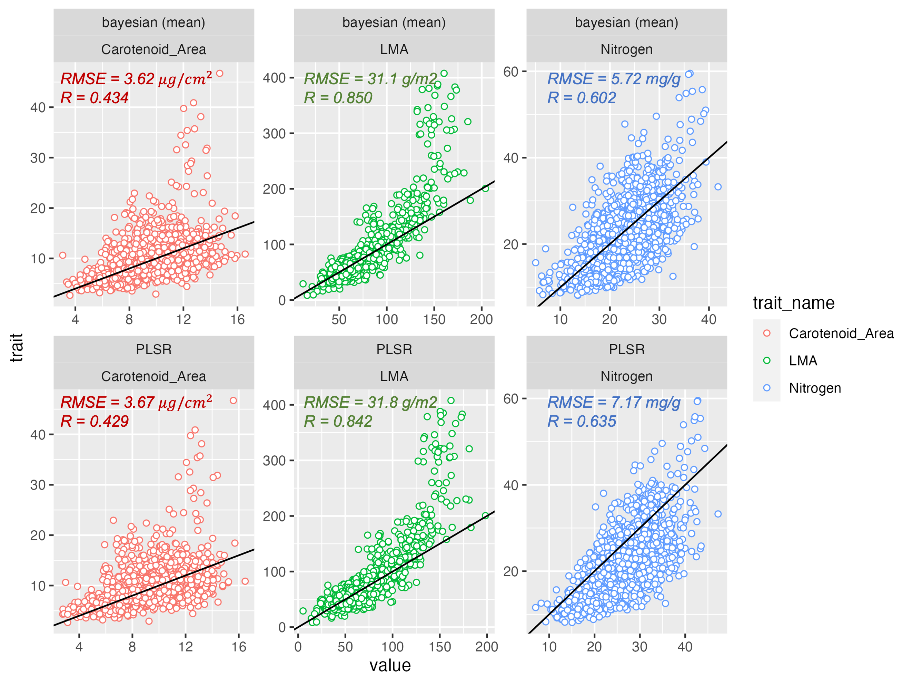
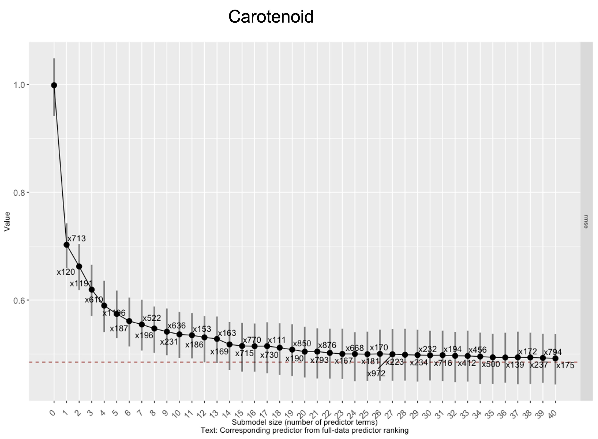
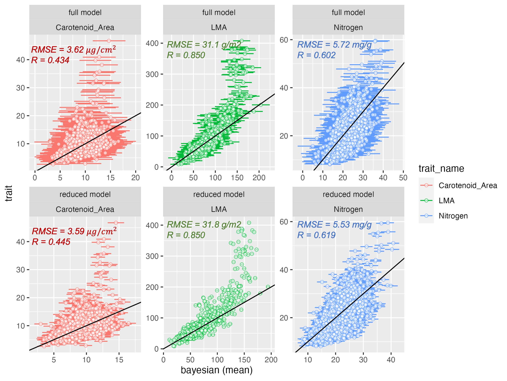

## Introduction

#### Importance of foliar functional traits

```{r}
#| echo: FALSE
# TODO: You can add other trait names from Roamresearch I.2-Paper-2
```

#### General importance

Foliar Functional traits are chemical (such as chlorophyll), physiological (such as photosynthetic rate) and structural (such as leaf area) features of a leaf which mediate ecosystem functioning and its response to perturbations by regulating the growth fitness of plants in diverse ecosystems [@serbin2020; @lavorel2002; @wright2005; @funk2017].

#### Leaf Economic Spectrum

In an ecosystem, foliar functional traits influence the resource allocation and reallocation of resources by a plant under diverse environmental conditions [@reich2014; @wang2020] and affect the functional diversity driving ecosystem productivity [@cadotte2009]

#### Role in Vegetation models

Foliar traits' significance in parameterizing terrestrial vegetation plays a crucial role in Earth System models, which, if not precisely characterized, introduces substantial uncertainty into climate change predictions [@wullschleger2014; @friedlingstein2006].

#### History of using spectroscopy for predicting foliar traits 

#### Empirical vs physically-based methods

Broadly, traits are predicted using reflectance spectra using two approaches: physically-based methods and empirical algorithms. The empirical approach has been the dominant method of predicting traits using spectra due to (a) ease in application, (b) higher accuracy than physically-based methods, and (c) ability to be applied on a wide range of traits [@wang2019]. Among empirical methods, though Machine Learning methods such as Random Forest [@pullanagari2016], Neural Networks [@huang2004; @cherif2023] , Gaussian Process Regression [@wang2019], etc., have shown considerable promise in recent studies, the Partial Least Squares Regression (PLSR) [@wold1984] remains the most widely used empirical approach for predicting a wide variety of traits (e.g., [@verrelst2019; @coops2003; @hansen2003; @serbinArcticTropicsMultibiome2019] due to its ease of use, computational efficiency and its ability to handle predictor (reflectance wavelengths for our study) collinearity. This is because PLSR transforms the input predictors into a handful of orthogonal latent components [@wold1984] and hence can be applied even when the number of predictors is greater than the number of training observations.

#### Drawbacks of PLSR approach 

The PLSR approach, however, comes with its own set of shortcomings. Chiefly, the PLSR approach to trait estimation does not provide rigorous uncertainty estimates but instead rely on . Another drawback of the PLSR approach is that it assumes a linear relationship between the traits and spectra. Though there have been a few applications of kernel based PLSR approaches for trait prediction (e.g. @arenas-garcia2008) , the majority of the studies still use the standard PLSR assuming a linear relationship between the traits and spectra. PLSR approaches also cannot account for the hierarchical structure that might exist in certain traits. PLSR is challenged by the variability of the relationship between traits and spectra across species, functional types, and biomes. It will either a global function between the traits and spectra which ignores the across-group variability or else it is used to fit functions separately for different groups which might not be always be possible due to scarcity of sampled trait data.

#### Benefit of the Bayesian approach

Bayesian methods provide rich uncertainty quantification and are easily amenable to more complex models such as hierarchical Bayesian models which can account site-specific, group-specific (such as PFT level, species level effects), easily integrate within physical models, and account for measurement errors of different instruments as well. Bayesian statisical methods have also been successfully used in accounting for change of scale measurements from point scale to satellite scale in different environmental domains. Therefore, trait estimation motivated by Bayesian empirical methods need more focus in addition to machine learning and PLSR based methods.

#### Ending 

The National Academy of Sciences 2017 Decadal Survey specifically identifies the spatio-temporal distribution of plant functional traits as a crucial objective (E-1a).\
It is not surprising that plant functional traits are identified as an Essential Biodiversity Variable (@pereira2013, @pettorelli2016).

## Study Area and Data

We use observations of three foliar traits: Carotenoid ( $Car_{area}$; area basis), Nitrogen ($N{mass}$; mass basis) and Leaf Mass per Area (LMA) paired with hyperspectral reflectance data from 400 nm to 2400 nm from publicly available Ecological Spectral Information System (EcoSIS) library (citation needed). The observation span a wide range of climatic and geographic range ( @fig-studyarea ) though the majority of the observations are from North America.

```{r studyarea}
#| echo: FALSE
#| label: fig-studyarea
#| fig-cap: "Study Area"
source("R_codes/Plotting/world_map_with_countries_used_highlighted.R")
plot(plot_out)
```

### Data Processing

We downloaded and processed all spectra and trait data from EcoSIS so that they have the same units across datasets. We took only those data which have all the reflectance spectral wavelengths available from 400 nm-2400 nm at a spectral resolution of 1 nm. Since the trait units are different across study areas, the traits are converted to common units; Carotenoid : $\mu g/cm^{2}$, Nitrogen : ($mg/g$) and LMA : $g/m^{2}$.

To avoid replication of effort in acquiring ECOSIS trait datasets, the entire workflow and associated R scripts for downloading the data from the ECOSIS website and compiling/processing the data to user-defined units is given here <!--# add hyperlink to Github page --> .

## Methods

In this section, we first describe the Bayesian regression model used in predicting traits using hyperspectral data. We elucidate models both in the actual spectral space as well as dimensionally reduced orthogonal space (similar to PLSR). Formulating appropriate priors is essential for high dimensional (where number of input spectral bands is large) problems, therefore we also define the relevant priors used in the current work. To enable computationally efficient prediction on new datasets and select wavelengths which best approximate the predictive capabilities of the above models, we transform both model to a simpler model on the original spectral space requiring only a subset of input spectra using projective inference [@juhopiironenProjectiveInferenceHighdimensional2020]. Notationally, we denote a scalar with a lower case letter and a vector with bold lower case letter. Superscript $T$ refers to transpose.

### Bayesian Regression model-Original hyperspectral space

Let the trait to be predicted be defined as a random variable $y$. For an $i^{th}$ observation, let the measured trait value be defined as $y_i$ and the corresponding input (intercept plus) hyperspectral wavelength be defined as the vector $\boldsymbol{x_i} = (1, x_{i,400}, x_{i,401}, ..., x_{i,2399}, x_{i,2400})$. We assume that $y_i$ is a linear function of $\boldsymbol{x}$ such that:

$$
y_i = \boldsymbol{\beta}^T \boldsymbol{x_i} + \epsilon_i, \; \epsilon \sim N(0, \sigma^2), \; i = 1,..., n
$$ {#eq-linear_model}

where $n$ is the number of observations.\
Here the length of $x_i$ i.e. intercept + the number of input wavelengths (400 nm - 2400 nm) is $p = 2002$. $\boldsymbol{\beta}$ denotes the corresponding regression coefficients for $\boldsymbol{x_i}$, and $\sigma^2$ is the noise variance. Let the training data for the regression model i.e. the $n$ observations of both the trait and spectra be denoted by $\mathcal{D}$.

#### Formulating priors

An important component of the Bayesian approach is to formulate appropriate priors for the parameter vector $\boldsymbol{\theta} :=(\boldsymbol{\beta}, \sigma^{2})$ used in the model.\
Since the dimension of $\boldsymbol{\beta}$ (2002) is large and a functional trait is typically sensitive to a small subset of the wavelengths, using traditionally used priors for $\boldsymbol{\beta}$ (such as normally distributed priors) can lead to over-fitting of the Bayesian model.\
This is especially true when the number of observations in \$\\mathcal{D}\$ is less than \$p = 2002\$.\
Since, a given trait is sensitive to a small number of wavelengths, we need a prior distribution which shrinks the \$\\beta\$ coefficients of the non-important wavelengths to zero while letting the regression coefficients of the important wavelengths escape this shrinkage.\
Such a prior distribution should therefore assign a high probability density at zero while also have heavy-tail (which allows the modeling of large values of \$\\beta\$) fo important wavelengths.\
To achieve this, we use a special prior distribution for $\beta_j$ called the regularized horseshoe prior [@piironen2017].\
The regularized horseshoe prior belongs to a class of priors called shrinkage or sparsifiying priors which shrink $\beta$ coefficients of the non-important wavelengths to zero and also have heavy-tails. For $j^{th}$ regresssion coefficient $\beta_j$, the regularized horsehoe prior is defined as:

$$
\begin{aligned}
& \beta_j|\tilde{\lambda_j}, \tau \sim N(0, \tau^2 \hat{\lambda_j}^2),  \; \tilde{\lambda_j^2} = \frac{c^2 \lambda_j^2}{c^2 + \tau^2 \lambda_j^2} \\
& \lambda_j \sim C^+(0, 1) \text{for } j = 1, ..., D \\
& c^2 \sim IG(\nu /2, \nu s^2/2) \\
& \tau^2 \sim C^+(0, \tau_0^2), \; \tau_0^2 = \frac{p_0}{p - p_0} \sigma \\
\end{aligned}
$$ {#eq-horseshoe}

where $C^+$ is a standard half-Cauchy distribution on the positive reals, IG is the inverse-Gamma distribution and $p_0$ is our prior crude guess on how many non-zero coefficients are there for the model .\
For our analysis, we set $\frac{p_0}{D-p_0}$ as 0.025 for all the traits, denoting our a-priori guess that around 50 wavelengths are important for predicting a particular trait.\
We fix $\nu = 4$ and $s = 2$ following [@piironen2017].\
The regularized horseshoe is an extension of the horseshoe prior [@carvalho2010] which has been widely used in high-dimensional regression.\
Similar to the horseshoe prior, the $\tau$ parameter in regularized horseshoe prior drives all regression coefficients to zero.\
The thick Cauchy-tails for $\lambda_j$ allow some of the regression coefficients (of important wavelengths) to escape this shrinkage towards zero.\
The regularized horsehoe has an extra parameter $c$ which better penalizes the non-shrinkage coefficients (i.e. the regression coefficients that are not equal to zero).\
This helps if the regression coefficients are weakly identified and also improves the sampling robustness during posterior parameter inference using Markov Chain Monte Carlo (MCMC) methods.\
@fig-method_horseshoe_vs_gaussian gives the comparison between the regularized horseshoe prior and the Gaussian prior by simulating 500 samples for a regression coefficient \$\\beta_j\$ following @eq-horseshoe and from a Gaussian distribution with mean 0 and standard deviation 0.05.\
The horseshoe prior assigns a significantly higher probability at zero leading to better shrinkage of regression coefficients towards zero for non-important wavelengths.\
It also has a heavier tail than the Gaussian distribution allowing larger values for the beta coefficients for important wavelengths.\

{#fig-method_horseshoe_vs_gaussian}

```{r horseshoe}
#| echo: FALSE
# Uncomment below if you want to plot the horseshoe vs gaussian prior simulations

# library(extraDistr)
# library(ggplot2)
# m_eff <- 0.05
# nu <- 4
# s = 2
# n_sim <- 100000
# 
# set.seed(100)
# # simulating from regularized horseshoe
# beta_j <- density_j <-  vector()
# for(i in 1: n_sim)
# {
#   sigma = 1
#   tau_0_sq <- m_eff *sigma
#   tau_sq <- rhcauchy(n = 1, sigma = tau_0_sq)
# 
#   lambda_j <- rhcauchy(n = 1, sigma = 1)
# 
#   alpha = nu/2; beta <- (nu *s^2)/2
#   c_sq <- rinvgamma(n = 1, alpha = alpha, beta = beta)
# 
#   lambda_j_tilde_sq <- (c_sq * lambda_j^2)/(c_sq + tau_sq *lambda_j^2)
#   beta_j[i] <- rnorm(1, mean = 0, sd = sqrt(tau_sq * lambda_j_tilde_sq))
#   density_j[i] <- dnorm(beta_j[i], mean = 0, sd = sqrt(tau_sq * lambda_j_tilde_sq))
# }
# hist(beta_j, 1e4, freq = FALSE, col = "red")
# # simulating from normal distribution
# 
# sigma = 1
# beta_j_normal <- rnorm(n_sim, mean = 0, sd = sigma)
# density_j_normal <- dnorm(beta_j_normal, mean = 0, sd = sigma)
# hist(beta_j_normal, 1e4, freq = FALSE, col = "red")
# 
# ##make plot using ggplot
# 
# beta_df <- data.frame(value =  c(beta_j, beta_j_normal),
#                       prior = rep(c("horseshoe", "gaussian"), each = n_sim))
# 
# density_df <- data.frame(value =  c(density_j, density_j_normal),
#                       prior = rep(c("horseshoe", "gaussian"), each = n_sim))
# density_df <- density_df |> bind_cols(beta_df[, -2])
# colnames(density_df) <- c("density", "prior", "beta")
# 
# 
# histogram_plot <- ggplot(beta_df, aes(x = value, color = prior)) + 
#   geom_histogram(binwidth = 0.1) +
# #geom_freqpoly(linewidth = 0.5) +
#   facet_wrap(~prior) +
#   coord_cartesian (xlim = c(-5, 5))
# 
# density_plot <- ggplot(density_df, aes(x = beta, y = density,  color = prior)) + 
#   #geom_histogram() +
#   geom_smooth(method = "loess", se = F, span = 0.005) +
#   #facet_wrap(~prior) +
#   coord_cartesian (ylim = c(0, 1), xlim = c(-5, 5))
# 
# density_plot/histogram_plot
# 
# ggsave(filename = "paper_draft/figures/horseshoe_vs_gaussian.png",
#        height = 6,
#        width = 6,
#        units = "in")
```

### Model reduction in original spectral space

The two models in the previous approach were designed to give good predictions even if the model has redundant wavelengths as input. While the model in Section M.1 has high computational cost, model in Section M.2 loses interpretability due to projection of spectra into orthogonal latent dimensions. We want our predictive model to be (a) computationally fast when predicting new data, (b) interpretable and (c) be able to account for uncertainties in the input wavelengths. A direct way to achieve the above three objectives is to define a model which takes a relevant subset of the hyperspectral wavelengths as input (satisfying (a) and (c)) and does not do any transformation of input wavelengths (satisfying (b)) while still predicting comparably to the full model on new datasets.

Therefore, our aim is to find a reduced model such that

$y_i = \boldsymbol{\beta_{*}^T} \boldsymbol{x_{i*}} + \epsilon_i, \; \epsilon \sim N(0, \sigma^2), \; i = 1,..., n$

such that $|\boldsymbol{x_i*}| = p_{*} << \boldsymbol{x_i} = p =2002$ where $|\boldsymbol{a}|$ denotes the length of a vector $\boldsymbol{a}$. Note that, in this work our aim is not to find all wavelengths that are statistically related to the trait, but instead are only focused on finding a minimal subset of wavelengths that give a good predictive model for the given trait such that adding more wavelengths to the model will not significantly improve the predictive accuracy [@juhopiironenProjectiveInferenceHighdimensional2020].

{#fig-method_flowchart}

#### Posterior projection of full model

To formulate the reduced model, we use posterior projection [@juhopiironenProjectiveInferenceHighdimensional2020], which consists of replacing the posterior distribution of the parameters of the full model --e.g. $\boldsymbol{\theta}$ of the Bayesian regression model in Section M.1-- with a simpler distribution $q(\theta_{*}$). The full model is also called the reference model and we denote posterior distribution of its parameters as $p(\boldsymbol{\theta}|\mathcal{D})$, where $\mathcal{D}$ is the training data. For the reference model in Section M.1, restricting the model means setting some regression coefficients in $\boldsymbol{\beta}$ in the reference model equal to zero. For supervised PC (Section M.3), since the reference model is now in the latent orthogonal space, the projection works a bit differently since the input variables in the reference model and the reduced model (original spectral scale) are not similar. Therefore, to make the method model agnostic, posterior projection is defined in terms of the loss in posterior predictive accuracy --in terms of the Kullback-Liebler or KL divergence-- when the reduced model is used in place of the reference model. Specifically,

$KL(p(\tilde{y}|\mathcal{D}) || q(\tilde{y}) ) = E_{\tilde{y}}(log(p(\tilde{y}|\mathcal{D})) - log(q(\tilde{y})))$

We use the 'tilde' notation to denote future measurements of the trait, hence $\tilde{y}$ denotes future measurement of the trait . Here, $p(\tilde{y}|\mathcal{D})$ is the posterior predictive distribution of future measurements of the trait given the training data $\mathcal{D}$ for the reference model, $q(\tilde{y})$ is the distribution of $\tilde{y}$ from the reduced model, $E_{\tilde{y}}$ means the expectation over all possible future measurements of the trait.The objective of the posterior projection approach is to find the reduced model $q(\theta_{*})$ that minimizes equation ().

In our case, we will use the posterior projection to determine the complexity (i.e the number of input wavelengths to be used) of our linear spectral model. There are various ways to empirically find the reduced model including draw-by-draw approach [@goutisModelChoiceGeneralised1998], [@dupuisVariableSelectionQualitative2003] and the single point approach [@tranPredictiveLasso2012]. Here we use the clustered projection approach by [@juhopiironenProjectiveInferenceHighdimensional2020] which can be thought of as a unification of the above-mentioned approaches and gives a nice tradeoff between speed and accuracy.

Equation () gives us the optimal model for a given complexity i.e. for a given number of input wavelengths $p_*$. To determine the minimum value of $p_*$, we compare the predictive utility of the reference model and the set of reduced models for each $p_*$ over a validation set. Since we are working in a Bayesian framework, we choose the mean log predictive density (MLPD) as our predictive utility function as it not only compares the point predictions but also the predictive uncertainties associated with the reduced model. This gives MLPD a significant advantage over commonly used utility functions such as mean squared error (MSE). For the validation set, we use K-fold cross validation, fitting and validating the reduced model K times to avoid over fitting.

The entire methodology is summarized in @fig-method_flowchart :

<!--# In @fig-method_flowchart, add the prior and add projection predictive variable as another figure at top. Maybe add the horsehoe prior as an image and add all spectra image first and then during the posterior projection, add it as a few spectra -->

## Results and Discussion

### Full Bayesian model

#### Posterior predictive checks

Bayesian analysis provides us with a formal way to assess how the model performs via posterior predictive checks. After fitting the three Bayesian models using the training data, the Bayesian models, in essence, become data generating models. We use posterior predictive checks [@gabry2019] to simulate the posterior predictive distribution $p(\hat{y}|y) = \int p(\hat{y}|\theta) p(theta|y) d\theta$, where y is the training trait data, $\hat{y}$ is the predicted data and $\theta$ are the parameters of the model. Posterior predictive checks serve as an important visual tool to assess how well the model agrees with the training data (or even independent test data). Here we use the posterior predictive checks to see how well the fitted Bayesian models simulate the training data. This will help us to determine the fit of the model. @fig-posterior_predictive_checks presents the posterior predictive checks of the three models. The blue lines represent 1000 replications of the training data simulated from the Bayesian models while the dark black line represents the empirical distribution of the observations.

We see that for all the three traits, thought the overall fit of the models to the training data is satisfactory, there are discrepancies associated with each trait. We assumed a normal model as our Bayesian model with the mean of the Bayesian model as a linear combination of the input spectra and a constant error variance. For the Carotenoid dataset, we can observe that the distribution of the data might be multimodal, which can motivate the use of a mixture of two normal models for better parameterizing the trait data. For LMA, the observations are much more skewed than a normal distribution, leading to poor fits for the left and right tail and the peak of the distribution. The fit for the Nitrogen data is much better, though there is a slight discrepancy in the lower tail of the distribution.

We find that overall, for all the three models, there is no overfitting to the observed data though @fig-posterior_predictive_checks points to further potential improvements in the model structure. Though improving individual trait models is beyond the scope of the current work, we provide some directions on how it can be achieved in the "Future Section" below.

{#fig-posterior_predictive_checks}

### Parameter inference

To determine the convergence of the parameters in the MCMC chain, the most widely used metric is the potential scale reduction factor $\hat{r}$ [@gelman1992]. The $\hat{r}$ values determine whether the independent parametesr of a model have converged or not. A value of $\hat{r}$ equal to 1 implies that the parameter has converged. In our analysis, we find that for many variables, the $\hat{r}$ values vary from <!--#  --> to <!--#  -->. This is a well known issue with the HMC sampler using horseshoe priors when dealing with highly correlated inputs with a low number of observations and has been shown to not cause any loss in predictive accuracy of the model [@piironen2017].

@fig-posterior_parameters_full_model shows the posterior parameter distribution histograms of the five wavelengths with largest absolute mean value for the regression coefficients. Since, the input spectral wavelengths are highly correlated to each other, they have redundant information available between them about the underlying trait. As a results, during the MCMC iterations, there will be some samples for which only one of these wavelengths will have a non-zero regression coefficient while the others will be zero leading to a big mass at zero. Since the wavelengths are highly correlated, each of the important wavelengths will have non-trivial probability mass at zero and non-zero coefficient values. Though, this does not cause any issues with predictions, it makes the posterior parameter distributions multimodal leading to confusion in parameter inference.

{#fig-posterior_parameters_full_model}

```{r posterior_parameters_histogram_full_model}
#| echo: FALSE
# uncomment to plot fig-posterior_parameters_full_model

# trait_name1 <- "Carotenoid_Area"
# 
# date_for_brms_file <- "2023-08-14" #this is the date the brms file was saved
# # in folder code data/code_output_data. brms
# # files are saved using supervised_pc_and....R
# # for personal macbooks
# data_folder <- "/Users/dhruvakathuria/Library/Mobile Documents/com~apple~CloudDocs/NASA_work/Github_data/Hierarchical_foliar_trait_estimation"
# 
# # Analysis for full model -------------------------------------------------
# 
# brms_normal <- readRDS(paste0(data_folder,  "/data/code_output_data/brms_object_",
#                               trait_name1, 
#                               "_",
#                               prediction_algorithm,
#                               "_",
#                               date_for_brms_file,
#                               ".rds"))
# 
# # fixed effects -----------------------------------------------------------
# 
# posterior_pars <- fixef(brms_normal, summary = F)
# spectra_regression_means <- colMeans(posterior_pars)
# indices_top_five <- which(spectra_regression_means %in% sort(abs(spectra_regression_means), decreasing = T)[1:5])
# wavelength_names <- names(spectra_regression_means)[indices_top_five]
# 
# wavelength_names <- unlist(lapply(wavelength_names, function(x) {str_split_1(x, "x")[2]}))
# 
# wavelength_names <- paste(wavelength_names, "nm", sep = " ")
# 
# posterior_pars_max <- posterior_pars[, indices_top_five] |> 
#   as_tibble()
# 
# colnames(posterior_pars_max) = wavelength_names
# 
# 
# posterior_pars_max |> 
#   pivot_longer(cols = everything(),
#                names_to = "Wavelength",
#                values_to = "Regression Coefficient") |> 
#  ggplot2:: ggplot(aes(x = `Regression Coefficient`)) +
#   geom_histogram(color = "red") +
#   facet_wrap(~Wavelength) +
#   coord_cartesian(ylim = c(0, 5000))
# 
# ggsave(filename = "paper_draft/figures/parameter_posterior_histogram.png",
#        height = 5,
#        width = 5,
#        units = "in")
```

### Prediction of algorithm on CABO data

The comparison of the mean posterior prediction plots for the CABO dataset compared with the PLSR plots are given in @fig-plsr_vs_bayesian_full . We find that the mean posterior predictions are comparable to the PLSR algorithm predictions slightly outperforming it for Carotenoid and LMA while significantly improving upon PLSR for Nitrogen in terms of RMSE. For Nitrogen data, the bayesian approach corrects for the bias in PLSR which leads to an improvement in the RMSE values. It is also important to note that the for both Carotenoid and LMA data, the Bayesian (and the PLSR) algorithm does poorly in predicting some of the trait values. Though it might not always be the case, this is similar to our findings from the posterior predictive checks in @fig-posterior_predictive_checks where Carotenoid and LMA did poorly compared to Nitrogen dataset.

The Bayesian algorithm comes with the added advantage of providing posterior predictive uncertainty along with the mean predictions which allows us to assess the variability of our predictions associated with new datasets. The top row of @fig-bayesian_full_vs_bayesian_reduced represents the 90% prediction intervals associated with each of the predictions. We find that the uncertainty is the highest for the Carotenoid dataset while it is the least for the LMA dataset. This is understandable as the training data for Carotenoid was the least (??? training observations) and was the highest for LMA ( ??? training observations).\
\
The above results showcase the advantage of the Bayesian approach over the traditional PLSR algorithm. First, the Bayesian methods works in the original spectral space as opposed to any transformed latent scale. Combined with the projective inference algorithm, as will be shown in the next section, this helps in understanding which spectra are relevant for a particular trait and also allow a natural way for input spectral uncertainty. Input spectral uncertainty becomes especially important when statistical algorithms are applied for remote sensing data such as airborne and satellite data which are subject to errors due to various atmospheric and topographical effects on remote sensing retrievals. Second, the Bayesian method provides uncertainty in predictions in the form of posterior prediction intervals. Though PLSR methods can also account for predictive uncertainties using bootstrap (give Singh paper citation), it does not take into account the prior information we might have about the relationship of the spectra with trait.\

{#fig-plsr_vs_bayesian_full}

<!--# Included comparison with the PLSR approach -->

<!--# Included the parameter uncertainty quantification plots -->

<!--# includes the prediction uncertainty quantification plots -->

## Reduced Bayesian model

Though the full Bayesian model has good predictive capabilities, it is neverthless slow in predicting new data as it requires 2001 spectral bands as input. A commonly mentioned advantage of latent transformation approaches such as the PLSR is their enhanced computational speed due to a few latent input variables. To allow for fast computational speeds for the Bayesian method, we use the projective inference technique mentioned in Section ?? to each of the three fitted Bayesian models while preserving the predictive accuracy of the full Bayesian models. The projective inference also helps us to identify the relevant spectra important for a particular trait.

{#fig-carotenoid_variable_selection width="544"}

To account for possible overfitting, we take the first 40 important spectra as found by the projective inference technique ( @fig-carotenoid_variable_selection ). Fig @fig-bayesian_full_vs_bayesian_reduced presents the comparison of the posterior predictive uncertainty between the full Bayesian model and the reduced model. We find that in terms of comparing the uncertainty between the two models, the reduced model reduces the posterior predictive uncertainty on the CABO dataset.

{#fig-bayesian_full_vs_bayesian_reduced}

@fig-spectra_importance shows the important spectra for each of the given traits.

{#fig-spectra_importance}

<!--# includes the plots for parameter uncertainty -->

<!--# includes the speed comaparison -->

### Future Direction

In this work, we have restricted ourselves to using linear gaussian model with a fixed measurement error. But as @fig-posterior_predictive_checks shows us, a simple linear model might not be enough to characterize the effects of spectra on traits. A distinct advantage of Bayesian methods is their ability to easily add complexity to an existing model structure. There are various ways in which we can extend the current linear model. First, we can relax the assumption of a Gaussian model for the traits and experiment with other probability density functions such as Gamma distributions, Student-t distributions and mixture models. The posterior predictive checks or other formal measures of model comparison such as the Deviance Information Criterion (DIC) can be a way to select the appropriate model. Second, we can extend the global Gaussian model to a hierarchical model by recognizing the inherent groups that exist in plants ( @fig-hierarchical_model) such as broadleaf/needleleaf, deciduous/evergreen, etc. Bayesian hierarchical methods explicitly accommodate variability in the relationship between traits and spectra across different groups , effectively sharing information and improving parameter estimation (which is especially important for undersampled groups). Lastly, the linear relationship between spectra and traits is another assumption that can be challenged. Bayesian methods are easily amenable to include non-linear effects of spectra on traits.

## Conclusion

<!--# Includes work on how to extend the work to non-linearity -->

<!--# Includes the discussion of hierarchical modeling -->

{#fig-hierarchical_model}

## References
