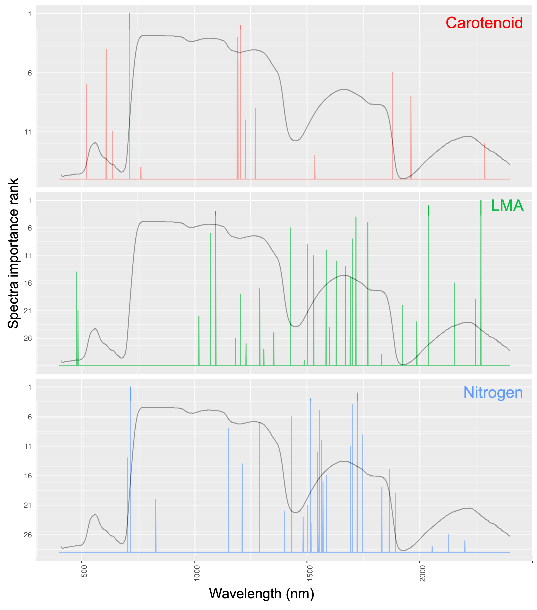
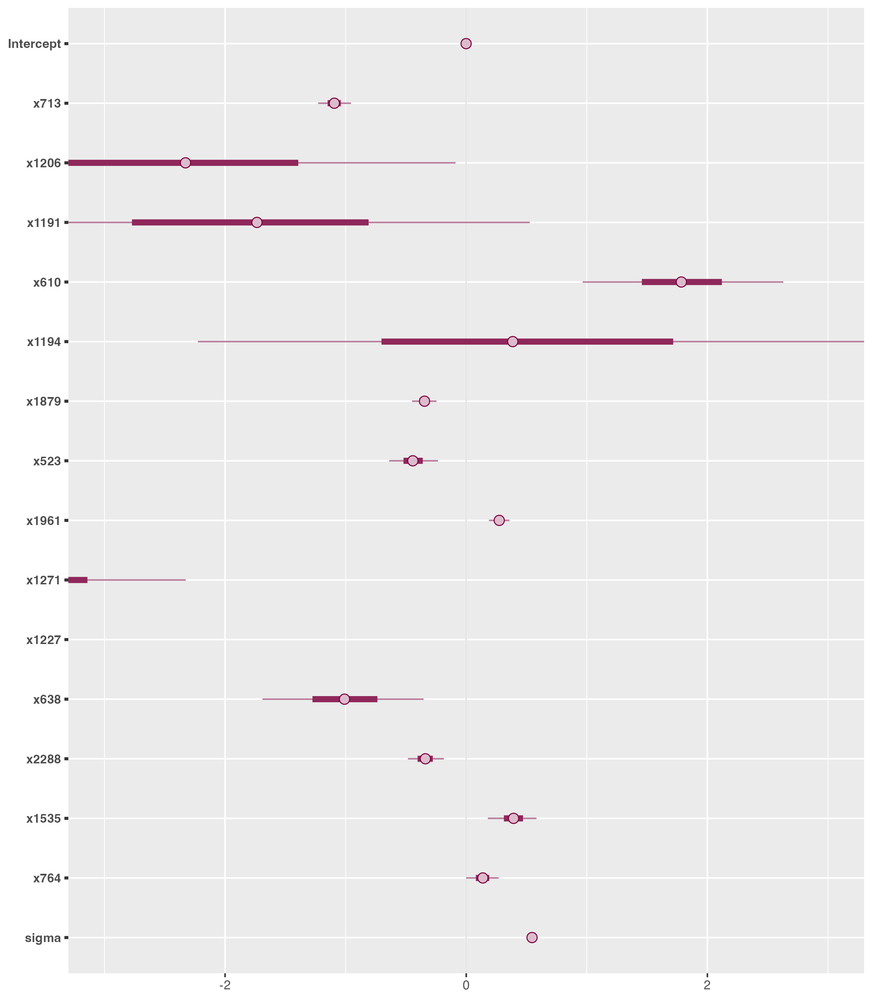

<!-- TODO: Abstract -->

# Introduction

```{r}
#| echo: FALSE
# TODO: You can add other trait names from Roamresearch I.2-Paper-2
```

Foliar functional traits are chemical, physiological, and structural features of leaves that mediate ecosystem functioning and response to perturbations by regulating plant growth and fitness in diverse ecosystems \[ @lavorel2002; @wright2005; @violle2007; @violle2014\]. <!-- DK_resolved: I would cite some papers by Cyrille Violle here; e.g., 10.1111/j.0030-1299.2007.15559.x, 10.1073/pnas.1415442111 . And maybe drop some of these other papers that aren't quite as foundational in defining the trait concept. --> In an ecosystem, foliar functional traits influence resource allocation and reallocation by plants under diverse environmental conditions [@reich2014; @wang2020] and affect the functional diversity driving ecosystem productivity [@cadotte2009]. Foliar traits are important parameters in dynamic vegetation and Earth System models, and uncertainty and variability in foliar traits are major sources of uncertainty in model predictions of ecosystem composition and function [@wullschleger2014; @friedlingstein2006; @shiklomanovStructureParameterUncertainty2020]. The National Academy of Sciences 2017 Decadal Survey specifically identifies the spatio-temporal distribution of plant functional traits as a crucial objective (E-1a). Plant functional traits are also identified as an Essential Biodiversity Variable (@pereira2013; @pettorelli2016).

Leaf-level measurements of light reflectance and absorption have been used to quantify leaf pigments and leaf structure since the early 1900s [@serbin2020; @cotrozziReflectanceSpectroscopyNovel2018], with important early papers by @shull1929, @mcnicholasVisibleUltravioletAbsorption1931, @rabideauAbsorptionReflectionSpectra1946, @clark1946, @krinovSpectralReflectanceProperties1947, and @gates1965. The past two decades have witnessed an increased application of a wide variety of retrieval algorithms to quantify different vegetation characteristics, including plant functional traits, using hyperspectral data (see @verrelst2019 for a review).

Broadly, leaf-level traits are predicted using reflectance spectra through two approaches: physically-based methods and empirical algorithms. The empirical approach has been the dominant method of predicting traits using spectra due to (a) ease of application, and (b) ability to be applied to a wide range of traits [@wang2019]. <!-- Here and elsewhere, it's worth being careful to distinguish between estimating traits from remote measurements (e.g., aircraft) and traits estimates from field measurements. Make sure that when we are talking about challenges of RTMs vs. data-driven methods, we are specifically talking about leaf level measurements --- the findings will be quite different!  DK_resolved: "added the term leaf-level traits and removed that empirical methods are more accurate than physical methods."--> Among empirical methods, Partial Least Squares Regression (PLSR) [@wold1984], Random Forest [@pullanagari2016], Neural Networks [@huang2004; @cherif2023], and Gaussian Process Regression [@wang2019] have shown considerable promise. Among these approaches, only Gaussian Process Regression allows rigorous uncertainty quantification, but it is computationally expensive.

The PLSR approach remains the most widely used empirical approach for predicting a wide variety of traits (e.g., @verrelst2019; @coops2003; @hansen2003; @serbinArcticTropicsMultibiome2019) due to its ease of use, computational efficiency, and ability to handle predictor (spectral wavelengths for our study) collinearity. This is because PLSR transforms the input predictors into a handful of orthogonal latent components [@wold1984] and hence can be applied even when the number of predictors (e.g., spectral bands <!-- Right? Assuming this is what you mean... Dk_resolved: yes -->) is greater than the number of training observations. However, the PLSR approach comes with its own set of shortcomings. Chiefly, the PLSR approach to trait estimation does not provide rigorous uncertainty estimates but instead relies on resampling strategies such as bootstrapping, which can lead to inaccurate confidence intervals for small to medium datasets [@chernick2009; @hesterberg2015]. The number of components selected by the PLSR approach, using cross-validation, can also vary significantly if training data is changed slightly, leading to users artificially limiting the number of PLSR components (based on the trait) without scientific or statistical justification. <!-- Suggest a reference here on how this is currently done. I think current best practice is to minimize the PRESS statistic; you can refer to Shawn's original paper on this, 10.1093/jxb/err294, or references therein (Wolter et al. 2008) --> It is also difficult to extend the PLSR approach to account for hierarchical multivariate relationships that might exist in certain traits [@shiklomanovDoesLeafEconomic2020]; consequently, it is challenged by the variability of the relationship between traits and spectra across species, functional types, and biomes. This limitation can be especially pronounced for under-sampled species.

::: content-hidden
Another drawback of the PLSR approach is that it assumes a linear relationship between the traits and spectra. Though there have been a few applications of kernel based PLSR approaches for trait prediction (e.g. @arenas-garcia2008), the majority of the studies still use the standard PLSR assuming a linear relationship between the traits and spectra. <!-- [Alexey] This is an important point. I suggest including this in the discussion. -->
:::

To account for certain shortcomings of PLSR (and other empirical approaches), Bayesian regression methods offer an attractive alternative. Bayesian methods provide robust uncertainty quantification, integrate with physical models, and accommodate measurement errors from various instruments. They are readily adaptable to more complex models, such as hierarchical Bayesian models [@shiklomanovDoesLeafEconomic2020], which can account for site-specific and group-specific effects (e.g., at the PFT or species level). Bayesian statistical methods have also been successfully employed to combine multi-sensor measurements from point scale to satellite scale across different environmental domains [@gelfandChangeSupportProblem2001; @kathuria2019]. Furthermore, Bayesian methods can incorporate information from secondary sources <!-- Inappropriate citation. Isofit is just Bayesian RTM fitting; it's not using RTMs as a secondary source of information. DK_resolved: removed the citation--> and expert opinions, in the form of prior distributions. This capability makes them valuable tools in the recent push for hybrid physical-empirical trait estimation approaches [@bergerCropNitrogenMonitoring2020].

The objective of this paper is to present a computationally efficient Bayesian framework that estimates traits directly from reflectance spectra (without any latent transformation) while rigorously propagating uncertainties. To achieve this, we employ a special class of shrinkage priors that enable us to use Bayesian regression with high-dimensional, correlated hyperspectral data while preventing overfitting. To enhance the computational efficiency of the Bayesian algorithm, we apply a predictive projection technique [@juhopiironenProjectiveInferenceHighdimensional2020] that projects the full Bayesian model onto a reduced model with a select few input wavelengths while preserving predictive accuracy. This technique is distinctive in that the selection of relevant wavelengths is based on predictions arising from the Bayesian model (which accounts for measurement error) rather than directly using the noisy trait observations for variable selection. Past studies have demonstrated that even when the true error structure of the data is unknown, model reduction techniques such as the one described outperform variable selection methods directly applied to (noisy) observations [@piironenComparisonBayesianPredictive2017]. We also discuss how the Bayesian framework can be easily extended to complex models such as hierarchical, multivariate, and non-linear models, which will potentially open a previously unexplored research territory of exploring novel relationships between spectra and traits.

# Materials and Methods

## Study Area and Data

To assess the feasibility of the proposed Bayesian method, we use paired observations of spectra and traits for three foliar traits: carotenoid content per unit area, nitrogen mass fraction, and leaf mass per area (LMA), paired with hyperspectral reflectance data from 400 nm to 2400 nm from the publicly available Ecological Spectral Information System (EcoSIS) library (https://ecosis.org). LMA influences leaf longevity, light interception by leaves, and affects photosynthetic productivity [@wright2004; @díaz2016; @reich2014; @wang2019; @cherif2023]. Leaf nitrogen is related to plant photosynthetic rate --most importantly through ribulose-1,5-bisphosphate carboxylase/oxygenase (Rubisco)-- and is useful for parameterizing photosynthetic processes in ecosystem models [@evansPhotosynthesisNitrogenRelationships1989; @onoda2017; @evansNitrogenCostPhotosynthesis2019] <!-- Also take a look at 10.1111/nph.14496. DK_resolved: added citation -->. Carotenoids are leaf pigments crucial for photosynthesis, photooxidative protection, pigmentation, and phytohormone synthesis [@armstrongCarotenoidsGeneticsMolecular1996; @maokaCarotenoidsNaturalFunctional2020; @sunPlantCarotenoidsRecent2022]. Carotenoid-derived compounds affect the flavor and aroma of crops, as well as the development of defense-related plant compounds [@simkinCarotenoidsApocarotenoidsPlanta2021].

The observations used for training the models span a wide range of climatic zones and biomes (@fig-studyarea). The three traits were also chosen because the number of training observations varies significantly across the three traits (carotenoid: 394, nitrogen: 541, LMA: 5,934), which helps demonstrate the algorithm's accuracy across different training set sizes. To validate the algorithms, we hold out data collected as part of the Canadian Airborne Biodiversity Observatory (CABO; @kothari2023) from 2018-2019. The CABO dataset is chosen as it represents a comprehensive number of observations for all the analyzed traits (carotenoid: 1764, nitrogen: 1746, LMA: 1792) across a wide variety of plant growth forms: broadleaf trees ($\sim 51.3 \%$), graminoids ($\sim 18.0 \%$), forbs ($\sim 12.5 \%$), shrubs ($\sim 10.6 \%$), conifer trees ($\sim 6.5 \%$), vines ($\sim 0.8 \%$), and ferns ($\sim 0.3 \%$). The CABO dataset was primarily collected in Eastern Canada, with the rest of the dataset collected in Western Canada and Australia. All the CABO study sites depicted in @fig-studyarea measure all three traits.

```{r studyarea}
#| echo: FALSE
#| label: fig-studyarea
#| fig-cap: "Study Area"
#source("R_codes/Plotting/world_map_with_countries_used_highlighted.R")
```

{#fig-studyarea}

## Data Processing

We downloaded and processed all spectra and trait data from EcoSIS so that they have the same units across datasets. We took only those data which have all the reflectance spectral wavelengths available from 400 nm-2400 nm at a spectral resolution of 1 nm. Since the trait units are different across study areas, the traits are converted to common units; carotenoid : $\mu g/cm^{2}$, nitrogen : ($mg/g$) and LMA : $g/m^{2}$.

<!-- [Alexey] Depending on journal, this paragraph may need to go in a separate "Data availability statement" or similar. -->

To avoid replication of effort in acquiring trait datasets from the ECOSIS website, the entire workflow and associated R scripts for downloading the data from the ECOSIS website and compiling/processing the data to user-defined units is given here <!--# add hyperlink to Github page --> .

## Model description

In this section, we first describe the Bayesian regression model used in predicting traits using hyperspectral data. Formulating appropriate priors is essential for high dimensional problems (where number of input spectral bands is large) to avoid overfitting; thus we also define the relevant priors used in the current work. To enable computationally efficient prediction on new data while maintaining the predictive capabilities of the Bayesian model, we project the Bayesian model to a simpler model using predictive projection inference [@juhopiironenProjectiveInferenceHighdimensional2020]. As opposed to the full Bayesian model, the projected model requires only a subset of input spectral bands, thus improving computational speed and facilitating interpretation. Notationally, we denote a scalar with a lower case letter, a vector with bold lower case letter, and a matrix with an upper case letter. Superscript $T$ refers to transpose. All vectors are assumed to be column vectors.

### Full Bayesian regression model {#sec-full_bayesian_model}

Let the trait to be predicted be defined as a random variable $y$. For an $i^{th}$ observation, let the measured trait value be defined as $y_i$ and the corresponding input (intercept plus) hyperspectral wavelength bands be defined as the vector $\boldsymbol{x_i} = (1, x_{i,400}, x_{i,401}, ..., x_{i,2399}, x_{i,2400})$. We assume that $y$ has a Gaussian distribution such that the mean of the distribution $\mu(x) = E(y|x)$ is a linear function of $x$ with independent and identically distributed error having constant variance $\sigma^2$:

$$
\begin{aligned} 
y_i & = \mu(x_i) + \epsilon_i \;  \\
    &= \boldsymbol{\beta}^T \boldsymbol{x_i} + \epsilon_i, \; \epsilon \sim N(0, \sigma^2), i = 1,..., n
\end{aligned}
$$ {#eq-linear_model}

Here, $\boldsymbol{\beta}$ denotes the vector of corresponding regression coefficients for $\boldsymbol{x_i}$, and $n$ is the number of observations. Here the length of $\boldsymbol{x_i}$ is the number of input wavelengths (denoted by $l = 2001$), plus intercept. We can also write @eq-linear_model as a multivariate normal distribution of size $n$:

$$
p(\boldsymbol{y}|\beta, \sigma^2)  = N_n(\mu(X), \sigma^2I) = N_n(X\beta, \sigma^2I)
$$ {#eq-linear_model_probability}

where $\boldsymbol{y} = (y_1, y_2, .., y_n)$ is a vector of $n$ trait observations and $X$ is the corresponding $n \times (l + 1)$ matrix of input wavelengths, $I$ is an identity matrix of size $n$. Let the training data for the regression model i.e. $n$ paired observations of trait and spectra be denoted by $\mathcal{D}$.

#### Formulating priors

An important component of the Bayesian approach is to formulate appropriate priors for the parameter vector $\boldsymbol{\theta} :=(\boldsymbol{\beta}, \sigma^{2})$ used in the model. A prior distribution represents our belief about these parameters and their uncertainty prior to observing the training data $\mathcal{D}$. In this work, we start with the prior belief that a trait is sensitive only to a subset of the wavelengths. This prior belief makes sense because functional traits have been shown to be sensitive to particular wavelengths in the visible to shortwave infrared (VSWIR) region. Additionally, since the dimension of $\boldsymbol{\beta}$ is large and the available measured trait data is generally sparse, using traditionally used priors for $\boldsymbol{\beta}$ (such as normally distributed priors) can lead to over-fitting of the Bayesian model. This is especially true when the number of observations in $\mathcal{D}$ is less than or comparable to $l$.

Since, a given trait is assumed to be sensitive to a subset of the wavelengths, we need a prior distribution which shrinks the $\boldsymbol{\beta}$ coefficients of the non-important wavelengths (with respect to the analyzed trait) to zero while letting the regression coefficients of the important wavelengths escape this shrinkage. Such a prior distribution should therefore assign a high probability density at zero while also have a heavy-tail, i.e., have non-trivial probabilities for large values of $\boldsymbol{\beta}$ (which allows the modeling of large values of $\boldsymbol{\beta}$) for important wavelengths. To achieve this, we use a special prior distribution called the regularized horseshoe prior [@piironen2017]. The regularized horseshoe prior belongs to a class of priors called shrinkage priors which shrink $\boldsymbol{\beta}$ coefficients of the non-important wavelengths to zero and also have heavy-tails. The regularized horseshoe is an extension of the horseshoe prior [@carvalho2010] which has been widely used in high-dimensional regression because of its good theoretical properties and practical applications [@datta2013; @pas2014; @piironen2017; @vanerpShrinkagePriorsBayesian2019]. For $j^{th}$ regression coefficient $\beta_j$, the regularized horseshoe prior is defined as:

$$
\begin{aligned}
& \beta_j|\tilde{\lambda_j}, \tau \sim N(0, \tau^2 \hat{\lambda_j}^2),  \; \tilde{\lambda_j^2} = \frac{c^2 \lambda_j^2}{c^2 + \tau^2 \lambda_j^2} \\
& \lambda_j \sim C^+(0, 1) \text{for } j = 1, ..., l \\
& c^2 \sim IG(\nu /2, \nu s^2/2) \\
& \tau^2 \sim C^+(0, \tau_0^2), \; \tau_0^2 = \frac{l_0}{l - l_0} \sigma \\
\end{aligned}
$$ {#eq-horseshoe}

where $C^+$ is a standard half-Cauchy distribution on the positive reals, IG is the inverse-Gamma distribution and $p_0$ is our prior crude guess on how many non-zero coefficients are there for the model . For our analysis, we set $\frac{l_0}{l-l_0}$ as 0.025 for all the traits, denoting our a-priori guess that around 50 wavelengths are important for predicting a particular trait. Better a-priori guesses for individual traits can be set by consulting past literature but we avoid it to maintain generality of the proposed approach. We fix $\nu = 4$ and $s = 2$ following [@piironen2017].

The $\tau$ parameter in regularized horseshoe prior (@eq-horseshoe) drives all regression coefficients to zero while the thick Cauchy-tails for $\lambda_j$ allow some of the regression coefficients (of important wavelengths) to escape this shrinkage towards zero. The regularized horseshoe has an extra parameter $c$ which better penalizes the non-shrinkage coefficients (i.e. the regression coefficients that are not equal to zero) compared to the original horseshoe prior. This helps if the regression coefficients are weakly identified (which can happen if the input wavelengths are highly correlated) and also improves the sampling robustness during posterior parameter inference using Markov Chain Monte Carlo (MCMC) methods [@piironen2017]. Note that the regularized horseshoe prior does not make the shrunk $\boldsymbol{\beta}$ coefficients exactly zero, but "pulls" them towards zero.

```{r}
#| echo: FALSE
#source("R_codes/Plotting/horseshoe_prior_simulations.R")
```

@fig-method_horseshoe_vs_gaussian gives the comparison between the probability density functions of the regularized horseshoe prior and the Gaussian prior by simulating 500 samples for a regression coefficient $\beta_j$ following @eq-horseshoe and from a Gaussian distribution with mean 0 and standard deviation 0.05. The horseshoe prior assigns a significantly higher probability at zero leading to better shrinkage of regression coefficients towards zero for non-important wavelengths. It also has a heavier tail than the Gaussian distribution allowing larger values for the beta coefficients for important wavelengths. For the intercept term in $\boldsymbol{\beta}$ and the error variance $\sigma^2$ in the model, we use an improper flat prior in the brms package [@burknerBrmsPackageBayesian2017] denoting non-informative priors.

{#fig-method_horseshoe_vs_gaussian}

#### Parameter estimation

Bayesian inference consists of getting posterior probability distribution of the parameters of the Bayesian model -- as opposed to point estimates given by non-Bayesian methods such as PLSR -- denoting how are belief in the parameter distribution changes (with respect to the prior distribution) after we account for the training data $\mathcal{D}$. Assuming that the prior distribution of the parameters are independent from each other, the posterior parameter distribution is denoted by:

$$
\begin{aligned}
 p(\boldsymbol{\beta}, \sigma^2|\boldsymbol{y}) & \propto p(\boldsymbol{y}|\boldsymbol{\beta}, \sigma^2) p(\boldsymbol{\beta},\sigma^2) \\
  & = p(\boldsymbol{y}|\boldsymbol{\beta}, \sigma^2)p(\sigma^2)\prod_{j=1}^{l}p(\beta_j)
\end{aligned} 
$$ {#eq-posterior_parameter_full_model}

where $p(\boldsymbol{y}|\boldsymbol{\beta}, \sigma^2)$ is given by @eq-linear_model_probability. For computing the posterior probability distribution, we use the probabilistic programming language Stan [@standevelopmentteam2018] which uses Markov chain Monte Carlo (MCMC) algorithms such as the Hamiltonian Monte Carlo (HMC) [@duaneHybridMonteCarlo1987] and its extension the No-U-Turn Sampler (NUTS) [@hoffmanNoUTurnSamplerAdaptively2014]. These algorithms work well with high dimensional models and can be used with any prior distribution [@hoffmanNoUTurnSamplerAdaptively2014; @betancourtConceptualIntroductionHamiltonian2017; @burknerBrmsPackageBayesian2017]. The Stan implementation is done using the R language interface provided by the package "brms" [@burknerBrmsPackageBayesian2017].

<!--# TODO: A bit more on MCMC implementation --- number of chains, convergence diagnostics, etc. Flagging this as still needed! -->

### Model reduction in original spectral space

Though the full Bayesian model in @sec-full_bayesian_model is formulated to have good predictive accuracy, it makes use of all the input wavelengths to predict new data and as a result and has a high computational cost. <!-- I dropped the interpretability; I'm not convinced more vs. fewer bands is any more/less interpretable. DK_resolved: agreed--> We remedy this by defining a model which takes a relevant subset of the input hyperspectral wavelengths (of length $l_s$) as input while still mimicking the predictive capability of the full model. Therefore, our aim is to find a sub-model:

$$
\begin{aligned} 
y_i & = \mu_s(x_{s,i}) + \epsilon_{s,i}  \\
   & = \boldsymbol{\beta_{s}^T} \boldsymbol{x_{s, i}} + \epsilon_{i,s}, \; \epsilon_s \sim N(0, \sigma_s^2), \; i = 1,..., n;  \\
\boldsymbol{y} &= (y_1, ..., y_n) = N_n(X_s\boldsymbol{\beta_s}, \sigma_s^2I)
\end{aligned}
$$ {#eq-linear_equation_sub_model}

which has similar predictive accuracy as the full Bayesian model in @sec-full_bayesian_model but with $l_{s} << l$. Note that this approach does not to find all wavelengths that are statistically related to the trait (also known as multiple hypothesis testing), but instead finds a reduced model consisting of a minimal subset of wavelengths that has similar predictive capability as the full model such that adding more wavelengths will not significantly improve predictive accuracy [@juhopiironenProjectiveInferenceHighdimensional2020].

```{r}
#| echo: FALSE
#ppt_file = "paper_draft/figures/ppt_for_figures.pptx"
```

{#fig-method_flowchart}

#### Projection of full model to reduced model {#sec-methods_posterior_projection}

To formulate the reduced model, we use predictive projection inference [@juhopiironenProjectiveInferenceHighdimensional2020], which consists of replacing the posterior distribution of the parameters of the full model with the posterior distribution of the reduced model. Since our aim is to transfer the predictive capabilities of the full model to a reduced one, the posterior projection is defined in terms of the loss in posterior predictive accuracy of the trait $y$ --in terms of the Kullback-Liebler or KL divergence [@kullback1951] -- when the reduced model is used in place of the full model. For posterior samples $\{\beta^m, (\sigma^2)^m\}_{m=1}^M$ from the full Bayesian model (@sec-full_bayesian_model), and a candidate reduced model of size $s$ with input wavelength matrix $X_s$ (@eq-linear_equation_sub_model) it can be shown (refer @juhopiironenProjectiveInferenceHighdimensional2020 for a full derivation) that this loss is minimized when the parameters of the reduced candidate model has the following form:

$$
\begin{aligned}
\beta_s^m = (X_s^TX_s)^{-1}X_s^T\mu^m(X) = (X_s^TX_s)^{-1}X_s^T(X\beta^m) \\
(\sigma_s^2)^m = (\sigma^2)^m + \frac{1}{n} ||X_s\beta_s^m - X\beta^m||^2; m = \{1, ..., M\}
\end{aligned}
$$ {#eq-projected_parameters}\
where $||a - b||^2$ –also called the L2 norm– computes the sum of the squared differences between corresponding elements of the two vectors $a$ and $b$. The solution for $\beta_s$ is familiar least squares solution for linear regression models, but now the trait observations $\boldsymbol{y}$ have been replaced by the posterior samples of the expected predictions $\{\mu^m(X) = X\beta^m\}_{m = 1}^M$ of the full Bayesian model. The projected variance of the reduced model $(\sigma_s^2)^m$ denotes that it is equal to the variance of the full model plus systematic variation captured by the full model but not by the reduced model. Hence, the predictive uncertainty of the reduced model is always greater than or equal to the full model which helps prevent over fitting of the reduced model [@juhopiironenProjectiveInferenceHighdimensional2020] and give a better measure of uncertainty when we trade off model complexity between the full and reduced models. To get to the final reduced model, we have two considerations: (1) selecting wavelength bands for the model of size $s$, since a large number of candidate models exist for a given model size $s$, and (2) selecting the size of the final reduced model $s_{final}$. Since this leads to a huge number of candidate models, we adopt the search heuristic which, starting from an intercept-only reduced model, adds one wavelength at a time (using forward variable selection) which minimizes the KL-divergence among all the possible wavelengths upto a predetermined maximum number of wavelengths (40 wavelengths in our study). The final size of the model $s_{final} \leq 40$ is chosen which minimizes the k-cross validation root mean squared error (RMSE) between the full model and the reduced model. The details of the implementation are given in Supplementary Information SI; ??, and further details regarding the approach can be found in [@juhopiironenProjectiveInferenceHighdimensional2020]. The projection is done with the help of R package projpred [@piironenProjpredProjectionPredictive2023].

::: content-hidden
Specifically,

$$
KL(p(\tilde{y}|\mathcal{D}) || q(\tilde{y}) ) = E_{\tilde{y}}(log(p(\tilde{y}|\mathcal{D})) - log(q(\tilde{y})))
$$

We use the 'tilde' notation to denote future measurements of the trait, hence $\tilde{y}$ denotes future measurement of the trait . Here, $p(\tilde{y}|\mathcal{D})$ is the posterior predictive distribution of future measurements of the trait given the training data $\mathcal{D}$ for the reference model, $q(\tilde{y})$ is the distribution of $\tilde{y}$ from the reduced model, $E_{\tilde{y}}$ means the expectation over all possible future measurements of the trait.The objective of the posterior projection approach is to find the reduced model $q(\theta_{*})$ that minimizes @eq-KL-divergence. In our case, we will use the posterior projection to determine the complexity (i.e the number of input wavelengths to be used) of our linear spectral model.\
\
Equation () gives us the optimal model for a given complexity i.e. for a given number of input wavelengths $p_*$. To determine the minimum value of $p_*$, we compare the predictive utility of the reference model and the set of reduced models for each $p_*$ over a validation set. For the validation set, we use K-fold cross validation, fitting and validating the reduced model K times to avoid over fitting. The entire methodology is summarized in @fig-method_flowchart.

Since we are working in a Bayesian framework, we choose the mean log predictive density (MLPD) as our predictive utility function as it not only compares the point predictions but also the predictive uncertainties associated with the reduced model. This gives MLPD a significant advantage over commonly used utility functions such as mean squared error (MSE).
:::

<!--# In @fig-method_flowchart, add the prior and add projection predictive variable as another figure at top. Maybe add the horsehoe prior as an image and add all spectra image first and then during the posterior projection, add it as a few spectra -->

We also compared our new algorithm results against established best practices (e.g., @serbin2012) for estimating traits using PLSR. For our PLSR trait estimates, we standardized the input wavelengths to have a mean 0 and standard deviation 1 and used minimization of the Predicted Residual Sum of Squares (PRESS; @allen1971) in cross validation to determine the number of orthogonal PLSR components.

<!--# [Alexey] TODO: How we did the PLSR predictions for Figure 6.-->

## Analysis of results

<!-- All of this should go with the MCMC discussion above. This section should instead discuss things like observed vs. predicted plots / regressions, how we calculated summary statistics, etc. -->

We ran three MCMC chains in parallel, each for 50000 iterations (after a warmup of 10000 iterations), thinned at at an interval of 10 iterations resulting in a total of 15000 MCMC samples. To determine the convergence of the parameters in the MCMC chain, the most widely used metric is the potential scale reduction factor $\hat{r}$ [@gelman1992]. The $\hat{r}$ values determine whether the independent parameters of a model have converged or not. A value of $\hat{r}$ equal to 1 implies that the parameter has converged.

A distinct advantage of Bayesian paradigm is that it provides us with a formal way to assess how the model performs via posterior predictive checks. After fitting the Bayesian model using training data, they, in essence, become data generating models. We use posterior predictive checks [@gabry2019] to simulate the posterior predictive distribution $p(\hat{y}|\boldsymbol{y}) = \int p(\hat{y}|\boldsymbol{\boldsymbol{\theta}}) p(\boldsymbol{\theta}|\boldsymbol{y}) d\boldsymbol{\theta}$, where $\boldsymbol{y}$ is the training trait data, $\hat{y}$ is the predicted data and $\boldsymbol{\theta}$ are the parameters of the model. Posterior predictive checks serve as an important visual tool to assess how well the model agrees with the training data (or even independent test data).

# Results

## Full Bayesian model

### Convergence diagnostics and posterior predictive checks

<!-- I know this is technically a result, but it's not a very important one, and it's almost a methodological detail. So, I might consider putting some of this in the methods where we talk about MCMC convergence diagnostics and cutting the rest from the paper altogether (or punting it to the supplement). -->

A well-known issue with MCMC sampling using horseshoe priors when dealing with highly correlated inputs and a low number of observations is that the $\hat{r}$ values of some individual regression coefficients do not converge to 1. However, this has been shown not to cause any loss in the model's predictive accuracy [@piironen2017]. In our analysis, we observe the same phenomenon, although the percentage of $\hat{r}$ greater than 1.1 is very low ($0\%$ for carotenoid, $2\%$ for LMA, and $1\%$ for nitrogen), and most of the $\hat{r}$ values are very close to 1. Since the input spectral wavelengths are highly correlated with each other, they contain redundant information about the underlying trait. Consequently, during the MCMC iterations, there will be some samples for which only one of these wavelengths will have a non-zero regression coefficient, while the others will be zero, leading to a large probability mass at zero. For instance, each of the first four wavelengths for carotenoid with the largest absolute mean value for regression coefficients (SSI, Figure S?) have non-trivial probability mass at both zero and non-zero coefficient values. Although this does not cause any issues with predictions, it results in multimodal univariate posterior parameter distributions.

<!-- This could be merged with the next section, which you could just call "validation of the algorithm" (drop the "external") -->

For all three traits, we use the posterior predictive checks (@fig-posterior_predictive_checks) to see how well the fitted Bayesian models simulate the training data which help us to determine the fit of the model to training observations. The blue lines represent 1000 replications of the training data simulated from the Bayesian models while the dark black line represents the empirical distribution of the observations.

{#fig-posterior_predictive_checks}

###  Validation of the algorithms

<!-- This section is missing quantitative results throughout. I know it seems redundant with the figures, but you should include RMSE, R2, etc. numbers where appropriate (e.g., "PLSR algorithm predictions slightly outperforming both Bayesian models for carotenoid (PLSR RMSE = XX; Full Bayesian RMSE = YY; Reduced Bayesian RMSE = ZZ)". Key numbers should also appear in the abstract (which makes it easy to quickly see the high-level results of the paper). Also, a good idea to add an initial sentence to this paragraph to the effect of, "All three models did a good but imperfect job of predicting all three traits."  -->

For the validation (CABO) dataset, all three models did a satisfactory (but imperfect) job of predicting all three traits. In terms of the root mean squared error (RMSE), we find that the RMSE of mean posterior predictions of the full model ($RMSE_{full}$) is comparable to the RMSE of PLSR predictions ( $RMSE_{PLS}$) slightly outperforming it for carotenoid ($RMSE_{full}$ = 3.62 $\mu g/cm^2$; $RMSE_{PLS}$ = 3.67 $\mu g/cm^2$ ) and LMA ($RMSE_{full}$ = 31.15 $g/m^2$; $RMSE_{PLS}$ = 31.79 $g/m^2$ ) while significantly improving upon PLSR for Nitrogen ($RMSE_{full}$ = 5.79 $mg/g$; $RMSE_{PLS}$ = 7.17 $mg/g$ ) (@fig-plsr_vs_bayesian_full_reduced (a and b)). For nitrogen data, the Bayesian approach possibly corrects for the bias in PLSR estimation which leads to a significant improvement in the RMSE values. There is no significant improvement in correlation between the full model ($R_{full}$) and PLSR ($R_{PLS}$) for carotenoid ($R_{full}$ = 0.43; $R_{PLS}$ = 0.43 ) and LMA ($R_{full}$ = 0.85; $R_{PLS}$ = 0.84) while for Nitrogen the full Bayesian model ($R_{full}$ = 0.59) has a lower correlation than PLS ($R_{PLS}$ = 0.64).

It is also important to note that the for both carotenoid and LMA data, the Bayesian (and the PLSR) algorithm does poorly in predicting high trait values (especially for LMA and carotenoid) where the predictions from both algorithms under-predict the trait values. <!-- Be more specific here. Which trait values were estimated worst? Particularly high values? Particularly low values? Underestimating or overestimating? In general, a good results section will not only provide a summary of figures and their interpretation but will also highlight some specific results. DK_resolved: added the specific values that are being under-predicted. I also add a line about this in the discussion -->.

::: content-hidden
Though it might not always be the case, this is similar to our findings from the posterior predictive checks on training data in @fig-posterior_predictive_checks where carotenoid and LMA did poorly compared to nitrogen dataset.
:::

{#fig-plsr_vs_bayesian_full_reduced}

The Bayesian algorithm comes with the added advantage of providing posterior predictive uncertainty along with the mean predictions which allows us to assess the variability of our predictions associated with new datasets. <!-- The training data observations here are editorial and should probably be reserved for the discussion. Also, training data size may not be the only explanation. For example, LMA has much larger and more obvious spectral features than carotenoids (just look at the specific absorption coefficients for Car vs. Cm in PROSPECT). Also, LMA is a more clearly defined trait --- just dry mass per unit area --- than carotenoids --- which is an agglomeration of a bunch of spectrally different compounds. -->

```{r}
#| echo: FALSE
#source("/Users/dhruvakathuria/Documents/GitHub/Hierarchical_foliar_trait_estimation/R_codes/Plotting/posterior_predictions.R")
```

## Reduced Bayesian model

Though the full Bayesian model has good predictive capabilities, it is nevertheless slow in predicting new data as it requires all 2001 spectral bands as input. <!-- [Alexey] How slow is it, in seconds? How much faster, in seconds, is the reduced model? -->

For instance, on a 16 GB 2021 Macbook Pro, we resampled (with replacement) the CABO data for each trait 50,000 times and found the posterior predictive distribution using both the Bayesian models using 5000 posterior samples. The difference in speeds were (), (), () for carotenoid, nitrogen and leaf mass per area respectively. It should be noted that when we increased the number of predicted points to 100,000 the system ran out of memory for the full model but we could still predict the points using the reduced model pointing to a reduced working memory requirement for the reduced model due to the less number of parameters in the reduced model.

To allow for fast computational speeds for the Bayesian method, we use the projective inference technique (@sec-methods_posterior_projection) to each of the three full Bayesian models. In addition to faster computation, the projective inference also gives us an indication about the spectral wavelengths that are important for predicting a particular trait. Using k-fold (5-fold for carotenoid and nitrogen; 3-fold for LMA) cross validation (@sec-methods_posterior_projection; SI ???), we find the minimal subset of wavelengths ( @fig-carotenoid_variable_selection), such that adding more wavelengths to the model does not increase predictive accuracy when compared with the full Bayesian model. <!-- I'm not sure that computational speed/efficiency is the best thing to emphasize about the reduced model. Instead, I think it may be better to focus on things like flexibility to different sensor configurations, reduced number of parameters, etc. -->

```{r}
#| echo: FALSE
#source("R_codes/Plotting/projpred_wavelength_selection.R")
```

{#fig-carotenoid_variable_selection} <!-- I might consider punting this figure to the Supplement -->

<!-- [Alexey] We need to show the actual mean (+ error bar?) posterior coefficient values for the selected values. -->

This results in 14 wavelengths for carotenoid, 28 for nitrogen, and 30 for LMA (@fig-spectra_importance_4). <!--# this might be better suited in the discussion section -->For some of the wavelengths, the regression coefficients have much larger posterior intervals -- for instance, wavelengths 1191 nm and 1194 nm for carotenoid (@fig-univariate_posterior_parameter) -- overlapping zero. We might incorrectly assume that none of these two wavelengths are important, but in fact this arises because (conditional on other variables in the model), the wavelengths are strongly correlated with each other. This is not a problem for prediction, but it does mean that given this model and data, we cannot separate the influence of the two wavelengths on the trait (carotenoid) but only claim that a combination of the wavelengths influence the trait [@mcelreath2018]. In such a case, the posterior distributions of the two regression coefficients lie along a narrow ridge (SI, Figure S?), which implies that when the regression coefficient of one wavelength is large, the other is small (since their combination is what is associated with the trait), leading to a wide range of combinations of the two regression coefficients resulting in long univariate posterior parameter intervals.

```{r}
#| echo: FALSE
#source("R_codes/Plotting/study_sites_robinson_projection.R")
#source("R_codes/Plotting/whittaker_biomes.R")
#ppt_file = "paper_draft/figures/ppt_for_figures.pptx"
```

{#fig-spectra_importance_4}

```{=html}
<!--
I suggest redrawing this figure as follows:
1. Flip the axes, so the wavelengths are on the X axis (and the uncertainty ranges are vertical), and make the wavelengths actual quantitative values (not factors) so that we can see where on the spectrum they are.
2. As in the "Relevant wavelengths" figure, make 3 versions of this graph --- one for each trait.
-->
```
{#fig-univariate_posterior_parameter}

```{r}
#| echo: FALSE
#source("R_codes/Plotting/bivariate_and_marginal_posterior_plots.R")
```

@fig-plsr_vs_bayesian_full_reduced (b and c) presents the comparison of the posterior predictive distribution between the full Bayesian model and the reduced model for the CABO dataset. The RMSE and R metrics are given for the means of the respective predictive distributions when compared with the observations. We find that the reduced model predictions are comparable to the full model predictions but at a fraction of the computational cost. For example, if we want to find the posterior predictive distribution of a new dataset -- assuming naive multiplication of the mean term $X\beta$ ($X\beta_s$ for the reduced model) -- the increase in predictive speed is of the order $\frac{2001}{|a_s|}$, where $|a_s|$ is the number of wavelengths for the reduced model. <!--
Again, I find the "speed" argument here uncompelling unless you can show some *real* numbers on computational speed, *and* pair those with an argument about scaling this up to thousands of pixels. (E.g., A 5x speedup for a single regression that takes a few milliseconds is not that compelling, but when you do it for 100,000 pixels, it starts to matter).
A more compelling argument might be about the number of parameters, especially the variance-covariance matrix. The size of the variance-covariance matrix in the betas (assuming we're not forcing it to be sparse/diagnoal?) is the square of the number of selected wavelengths. That's not a huge memory footprint --- even a 2100 x 2100 matrix is only 35 MB in memory in the least efficient representation --- but it is a large number of parameters (even if it's just the upper/lower diagonal).
-->

```{r}
#| echo: FALSE
#source("/Users/dhruvakathuria/Documents/GitHub/Hierarchical_foliar_trait_estimation/R_codes/Plotting/posterior_predictions.R")
```

```{r}
#| echo: FALSE
#source("R_codes/Plotting/spectra_importance_rank.R")
```

### Important spectral regions for traits

As mentioned in @sec-methods_posterior_projection, the reduced model finds a minimal subset of wavelengths (which are not necessarily unique) such that adding more wavelengths to the model will not lead to a significant increase in the predictive accuracy when compared with the full model. We can, however, still use the spectral ranks (@fig-spectra_importance_4), to identify the VSWIR regions that are important for predicting a particular trait.

For carotenoid <!-- I suggest using the term "carotenoid content" throughout -->, the red-edge region -- characterized by a sudden increase in leaf reflectance usually between 700 nm to 750 nm [@cotrozziReflectanceSpectroscopyNovel2018] -- comprises the most important wavelength, along with moderately important wavelengths in the visible spectrum which is in line with previous research [@ustin2020; @falcioni2023] . <!-- "In line with previous research"-type statements should live in the discussion. --> Additionally, we find a cluster of sensitive wavelength in the near infrared region (NIR) from 1150 nm - 1300 nm around a known secondary water-absorption band at 1240 nm [@ustin2020] and some wavelengths in the short wave infrared region (SWIR) region (1300 nm - 2500 nm). For nitrogen <!-- I might consider abbreviating this as %N_mass or something in the methods and then using that throughout -->, the red-edge again comprises the most important wavelength with the rest of the important wavelengths clustered around the region 1400 nm - 1900 nm and 2000-2500 nm in the SWIR region. The water absorption band at 1240 nm again has some moderately important wavelengths clustered around it. For LMA, wavelengths in the SWIR region are generally the most important: The two most important wavelengths fall in the 2000 - 2500 nm region, while a cluster of important wavelengths fall in the 1500-2000 nm region.

```{r}
#| echo: FALSE
#source("R_codes/Plotting/spectra_importance_rank.R")
```

<!--# includes the plots for parameter uncertainty -->

<!--# includes the speed comaparison -->

# Discussion

```{=html}
<!--
The structure of the discussion does not have to mirror the structure of the results.
I think your discussion should have 3 major sections:
(1) Comparing the Bayesian and PLSR approaches. This is mostly focused on methodological/statistical things.
(2) Important spectral regions for traits. This should be more focused on ecology / biophysics. Notably, here, I would make sure to compare our important wavelengths against other PLSR studies where coefficients / important wavelengths are reported.
(3) Future directions.
-->
```
## Full Bayesian model

### Posterior predictive checks

<!-- I would drop this section. It's not that interesting. Dk_resolved: done -->

::: content-hidden
For all three traits, although the overall fit of the models to the training data is satisfactory, certain discrepancies are associated with each trait fit. We assumed a normal model for each trait with the mean modeled as a linear combination of the input spectra and a constant error variance. For the carotenoid dataset, we can observe that the distribution of the data might be multimodal; for LMA, the observations are much more skewed than a normal distribution, leading to poor fits for the left and right tails and the peak of the distribution; for nitrogen data, the fit is much better, although there is a slight discrepancy in the left tail of the distribution. \@fig-posterior_predictive_checks thus points to further potential improvements in the model structure. To ensure a fair comparison with the PLSR approach, we do not fine-tune the Bayesian model but provide some suggestions for doing so in @sec-future_direction. However, we wanted to highlight the importance of posterior predictive checks, which serve as a valuable visual tool for iterative Bayesian model building.
:::

### External validation of the algorithm

```{=html}
<!--
In this section, consider citing some papers from Combal on the use of prior information to help constrain biophysical retrievals --- 10.1051/agro:2002008, 10.1016/S0034-4257(02)00035-4
-->
```
The results showcase the advantages of the Bayesian approach over the traditional PLSR algorithm. First, the Bayesian method works in the original spectral space as opposed to a transformed latent scale. Since there is no spectral transformation, it paves the way for future work incorporating input spectral uncertainty in trait estimation <!-- There are other advantages to this, too. One is just conceptual simplicity of the coefficients. Another is greater flexibility to different instruments with different spectral configurations. -->. Input spectral uncertainty becomes especially important when statistical algorithms are applied to remote sensing data, such as airborne and satellite data, which are subject to errors due to the effects of various atmospheric and topographical factors on remote sensing retrievals <!-- Good place to cite some of the ISOFIT papers -->. Second, the Bayesian method provides rigorous uncertainty quantification in the form of posterior predictive credible intervals, which are easier to interpret than frequentist confidence intervals. <!-- Also a good place to mention that you are estimating a full posterior distribution, with not only univariate uncertainties but a full variance-covariance matrix, which allows you to account for autocorrelation in spectral bands (and, therefore, to borrow information across bands). --> Although PLSR methods can also account for predictive uncertainties using bootstrap [@singhImagingSpectroscopyAlgorithms2015a], bootstrap uncertainty attempts to approximate a non-informative posterior distribution by generally assuming that the training sample closely approximates the true population. This approach has been shown to produce inaccurate confidence intervals for small to moderate sample sizes [@chernick2009; @hesterberg2015]. Additionally, it does not take into account any prior information we might have about the relationship between spectra and traits.

## Reduced Bayesian model

### Important spectral regions for traits

::: content-hidden
Before interpreting the results, an often overlooked implicit assumption is that the important wavelengths selected by any model are dependent on the model specification and assumptions. A Bayesian approach is helpful in this regard, as we make explicit statements about our prior beliefs, the underlying trait distribution, and the measurement errors. This enables us to attribute significance to specific wavelengths strictly within the context of these predetermined model assumptions. For example, in this paper, we did not account for the important effects of climate, different land surface conditions, leaf health, across and within trait variation within plant functional types, site-specific measurement errors, etc. on traits, and assumed only the marginal effects of spectra on traits and a fixed Gaussian error term. This may lead to the latent influence of these variables on the significance attributed to certain wavelengths. A Bayesian model incorporating some or all of these variables in addition to spectra might yield different results for important spectra. It is useful to keep this distinction in mind when inferring about relevant wavelengths for any trait.
:::

<!-- 
The thing to note here is that what is most relevant to this paper is *not* the direct relationship between traits and climate/land-use/etc. (which is well established), but rather the ways that climate, land-use, etc. *alter the relationship between traits and spectra*. I'm not sure anyone has actually looked into this, at least directly. I could imagine mechanisms by which this would be the case, but they would need to be described with more detail and with some relevant physiological ecology references. This could also be an interesting future direction for this work --- the flexibility of the Bayesian approach may make it easier to think through these things.

Right now, the paragraph above is very hand-wavy and doesn't have a single reference.
I would either flesh it out with some more critical thinking about this problem, or I would just drop it altogeher. Dk_resolved: removed the paragraph
-->

<!-- In this paragraph, I suggest being a bit more explicit about what our results were, by injecting phrases like, "*In our results*, SWIR bands were most important for LMA"; "*We found that* the NIR region was useful for predicting LMA"; etc. -->

Leaf reflectance spectra in the SWIR region are sensitive to water absorption, leaf structure, and dry matter content [@ustin2020; @serbinArcticTropicsMultibiome2019]. Carotenoid content has been shown to change with leaf growth stage and is affected by water stress [@mibei2016], potentially explaining the sensitivity of the above wavelengths to carotenoid. These findings are consistent with previous studies (see @homolovaReviewOpticalbasedRemote2013 and @bergerCropNitrogenMonitoring2020 for comprehensive reviews). Nitrogen <!-- Note the distinction between Nitrogen content/concentration (mass N per leaf *area*) and Nitrogen mass fraction (mass N per leaf *mass*). Make sure these are apples-to-apples comparisons. --> has been shown to be moderately correlated with chlorophyll content <!-- ...right? Or is this chlorophyll mass fraction (which IME is more rarely reported)? Note that relating mass-normalized to area-normalized traits has some statistical problems; see, for instance, 10.1126/science.1231574 and discussion around this paper in the literature. I also talk about this in my Ecological Applications paper. This is one of the main reasons I harp on terminology: "Nitrogen mass fraction, %Nmass"; "carotenoid content/concentration" --> (with a correlation coefficient of $0.65 \pm 0.15$ across different ecosystems), which in turn has a strong absorption in the red-edge region (and the visible portion) of the spectrum. The water absorption region around 1200 nm has also been shown to be sensitive to nitrogen in past studies (@homolovaReviewOpticalbasedRemote2013). The SWIR region is also critical to predicting nitrogen, partly because proteins have distinct absorption features in this region [@fourtyLeafOpticalProperties1996; @curranRemoteSensingFoliar1989; @kumarImagingSpectrometryVegetation2001], and a large amount of leaf nitrogen is bound in proteins [@xu2012]. This has led to a recent push in recognizing proteins (in addition to chlorophyll) as a proxy for estimating leaf nitrogen [@bergerCropNitrogenMonitoring2020]. LMA has been shown to be correlated with different leaf features related to structure, dry matter, carbon, and leaf water content, which have absorption features in the SWIR region [@poorterCausesConsequencesVariation2009; @riva2016; @curranRemoteSensingFoliar1989; @kokalyCharacterizingCanopyBiochemistry2009; @ustin2020; @serbinArcticTropicsMultibiome2019]. The NIR region between 1000–1300 nm is also useful in predicting LMA, which is consistent with the findings of [@serbinArcticTropicsMultibiome2019], who posited that this dependence is driven by the covariation of LMA with leaf water, structural carbon, leaf thickness, and variations in the epidermis layer of the leaf, all of which are sensitive to the NIR region.

## Limitations and Future Direction {#sec-future_direction}

<!-- This is a new result. New results should not appear in the Discussion. Either flesh this analysis out by adding it to the methods and results, or (probably easier) remove it and save it for the follow-on paper. -->

{#fig-hierarchical_model}

```{=html}
<!--
[Alexey] Future directions:
- More traits
- More sophisticated methods (some of which you already have)
- Multivariate prediction --- not one trait at a time, but multiple traits jointly (cite my Ecological Applications multivariate traits paper here). 
- Remote sensing
-->
```
In this work, we have restricted ourselves to using a linear Gaussian model with a fixed measurement error. However, a simple linear model might not be sufficient to characterize the effects of spectra on traits (@fig-posterior_predictive_checks). A distinct advantage of Bayesian methods is their ability to easily add complexity to an existing model structure. There are various ways in which we can extend the current Bayesian model. First, we can relax the assumption of a Gaussian model for the traits and experiment with other probability density functions, such as Gamma distributions, Student-t distributions, and mixture models. The posterior predictive checks or other formal measures of model comparison [@gelmanBayesianWorkflow2020; @gabry2019] can be used to select the appropriate model. We will extend this work to more traits, such as chlorophyll, leaf water content, cellulose, lignin, calcium, phosphorous, magnesium, etc., using appropriate density functions and measurement errors. Second, we can extend the model to a hierarchical setup by recognizing the inherent groups that exist in plants (@fig-hierarchical_model), such as broadleaf/needleleaf, deciduous/evergreen, etc. Bayesian hierarchical methods explicitly accommodate variability in the relationship between traits and spectra across different groups, effectively sharing information and improving parameter estimation (which is especially important for undersampled groups). The linear relationship between spectra and traits is another assumption that can be challenged, and Bayesian methods are easily amenable to including non-linear effects of spectra on traits [@gelmanBayesianDataAnalysis2015].

Another exciting area of interest where Bayesian methods can play a role is in multivariate prediction, wherein we also account for the dependence/covariance of traits with each other. This can be done by assuming a multivariate normal distribution of traits (with a covariance matrix denoting how the traits covary with each other). Another approach that can be utilized is using Directed Acyclic Graphs (DAGs) [@mcelreath2018], which can also be used to disentangle the latent relationships existing between different trait values (e.g., see @chadwick2016) and to distinguish between the so-called optically "visible" traits and the "invisible" traits, the latter of which are hypothesized to show sensitivity to spectra due to their covariation with the visible traits. A causal approach such as DAGs can also help disentangle the effects of spectra on composite traits (such as nitrogen, which is a composite of proteins and pigments) into sub-component spectra-trait relationships. Such an approach can also inform physically based model improvement.

We restricted ourselves to leaf-level prediction of traits, but the Bayesian algorithm—and its extensions—are equally applicable to remote sensing imaging spectroscopy. It is an exciting time for hyperspectral imaging spectroscopy with the recently launched and upcoming satellite missions, such as PRecursore IperSpettrale della Missione Applicativa (PRISMA, @cogliati2021), Earth Surface Mineral Dust Source Investigation (EMIT, @green2022), Environmental Mapping and Analysis Program (EnMAP, @guanter2015), Surface Biology and Geology (SBG, @cawse-nicholson2021), and Copernicus Hyperspectral Imaging Mission for the Environment (CHIME, @nieke2023), which are poised to provide vast troves of VSWIR data globally. The uncertainty quantification arising due to different sensor characteristics, spatio-temporal sampling scales, and sub-pixel heterogeneity makes it all the more important to perform rigorous uncertainty quantification, and therefore, the use of Bayesian methods becomes even more crucial in such scenarios. Furthermore, Bayesian methods are well-suited to rigorously propagate uncertainties from the input reflectance, such as those introduced by Bayesian atmospheric correction algorithms (e.g., ISOFIT @thompson2018), to the estimated traits.

# Conclusion

In this paper, we present a computationally efficient Bayesian framework that estimates traits directly from reflectance spectra without latent transformation while rigorously propagating uncertainties. The results show that the Bayesian model performs comparably to or slightly better than the PLSR approach in terms of Root Mean Square Error (RMSE) for the three traits examined, while providing the advantages of working in the original spectral space, selecting relevant wavelengths for predictions, and offering posterior predictive uncertainties, which aid in assessing the variability of predictions on new datasets. The Bayesian framework is extendable to more complex models–such as hierarchical Bayesian models and multivariate trait prediction models–, can integrate with physical models and account for measurement errors of different instruments.

# References
