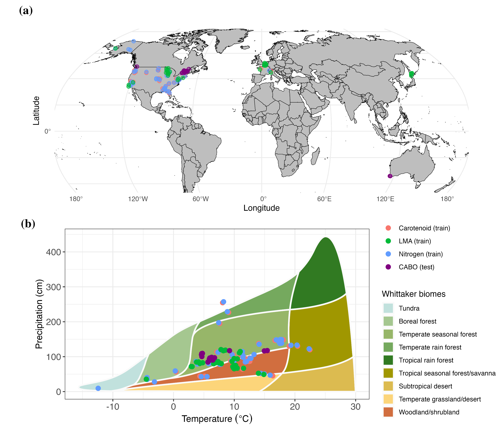
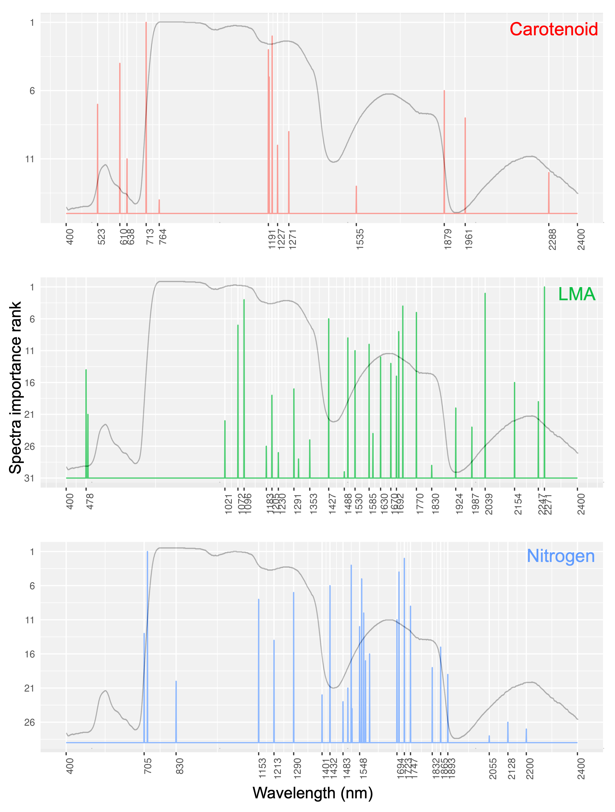

# Abstract

Leaf functional traits are leaf features that determine ecosystem functioning, plant growth regulation, and resource allocation. Most of these traits can be effectively derived from leaf reflectance measurements across the visible to shortwave infrared range using various empirical and physical methods. Partial Least Squares Regression (PLSR) is a popular empirical approach due to its simplicity and computational efficiency; however, it has notable limitations. These include the need for transforming spectra into latent components, challenges in uncertainty quantification, optimal selection of the number of components, and difficulty in extending to more complex models. In this study, we present a Bayesian approach for predicting leaf traits from leaf reflectance data---ranging from 400 to 2400 nm in 1 nm spectral---that addresses these limitations. The method eliminates the need for spectral transformation while enabling rigorous uncertainty quantification. We applied the Bayesian algorithm to predict three key traits: carotenoid content (Car~A~), nitrogen percentage mass (N~M~), and Leaf Mass per Area (LMA). On an independent validation dataset, we find that the Bayesian approach performs comparably to PLSR but with added flexibility and robust uncertainty quantification. To enhance computational efficiency, we project the full Bayesian model to a reduced model that relies on a select subset of wavelengths: 14 for Car~A~, 28 for N~M~, and 30 for LMA. This reduced model maintains predictive performance like the full model while offering faster predictions and insights into trait-specific wavelength sensitivity. The Bayesian method is highly adaptable, providing a framework for future development of non-linear, hierarchical, and multivariate trait prediction models with rigorous uncertainty quantification.

# Introduction

Leaf functional traits are measurable morphological, anatomical, physiological, biochemical, and phenological features that characterize plant species functioning, their environmental responses, and adaptation to changes [@lavorel2002; @wright2005; @violle2007]. As plants' primary photosynthetic organs, leaves drive the dynamic of terrestrial ecosystems. As a result, leaf traits are used as input parameters in global ecosystem models to account for photosynthetic capacity, plant growth, and biogeochemical cycles, and uncertainty and variability in leaf traits are major sources of uncertainty in model predictions of ecosystem composition and function [@wullschleger2014; @friedlingstein2006; @shiklomanovStructureParameterUncertainty2020]. The National Academy of Sciences 2017 Decadal Survey specifically identifies the spatio-temporal distribution of plant functional traits as a crucial objective (E-1a). Plant functional traits are also identified as an Essential Biodiversity Variable [@pereira2013; @pettorelli2016].

Many leaf traits can be estimated from leaf spectral measurements in the visible to shortwave infrared (VSWIR) range (\~350--2500 nm) using either empirical or physically-based estimation methods [@jacquemoudLeafOpticalProperties2019; @angelRemoteDetectionMonitoring2022]. To date, the empirical approach has been the dominant method of predicting traits using spectra due to (a) ease of application, (b) computational efficiency, and (c) ability to be applied to a wide range of traits [@wang2019]. Among empirical methods, Partial Least Squares Regression (PLSR) [@wold1984], Random Forest [@pullanagari2016], Neural Networks [@cherif2023], and Gaussian Process Regression [@wang2019] have shown considerable promise. Of these approaches, only Gaussian Process Regression allows rigorous uncertainty quantification, but it is computationally expensive.

PLSR remains the most widely used empirical approach for predicting a wide variety of traits [@verrelst2019; @hansen2003; @serbinArcticTropicsMultibiome2019] due to its ease of use, computational efficiency, and ability to handle predictor collinearity. This is because PLSR transforms the input predictors (in this case, reflectance at individual spectral bands) into a handful of orthogonal latent components and hence, can be applied even when the number of predictors is greater than the number of training observations. However, the PLSR approach comes with its own set of shortcomings. PLSR is prone to overfitting, necessitating the need of using computationally expensive ways---such as minimizing the cross-validation prediction residual sum of squares (PRESS) statistic [@allen1971]---to determine the number of latent components. In some cases, the PLSR method can still overfit, necessitating the need to set a threshold on the number of PLSR components. PLSR is highly sensitive to outliers even if the number of outliers is small compared to the total number of observations [@burnettBestpracticeGuidePredicting2021]. Additionally, the PLSR approach to trait estimation does not provide rigorous uncertainty estimates but instead relies on resampling strategies (such as bootstrapping), which can lead to inaccurate confidence intervals for small to medium datasets [@chernick2009; @hesterberg2015]. It is also difficult to extend the PLSR approach to account for hierarchical multivariate relationships that might exist in certain traits [@shiklomanovDoesLeafEconomic2020]; consequently, it is challenged by the variability of the relationship between traits and spectra across species, functional types, and biomes. This limitation can be especially pronounced for under-sampled species.

To account for certain shortcomings of PLSR (and other empirical approaches), Bayesian regression methods offer an attractive alternative. Bayesian methods provide robust uncertainty quantification, can integrate with physical models [e.g., @ohaganOxfordHandbookApplied2013], and accommodate measurement errors from various instruments [@gustafsonMeasurementErrorMisclassification2003]. They are readily adaptable to more complex models, such as hierarchical Bayesian models [@shiklomanovDoesLeafEconomic2020], which can account for site-specific and group-specific effects (e.g., at the plant functional type or species level). Bayesian statistical methods have also been successfully employed to combine multi-sensor measurements across spatial and temporal domains for different environmental applications [@gelfandChangeSupportProblem2001; @kathuria2019]. Furthermore, Bayesian methods can incorporate information from secondary sources and expert opinions, in the form of prior distributions. This capability makes them valuable tools in the recent push for hybrid physical-empirical trait estimation approaches [@bergerCropNitrogenMonitoring2020].

The objective of this paper is to present a computationally efficient Bayesian regression framework that estimates traits directly from reflectance spectra (without any latent transformation) while rigorously propagating uncertainties. To achieve this, we employ a special class of shrinkage priors that enable us to use Bayesian regression with high-dimensional, correlated hyperspectral data while preventing overfitting. To enhance the computational efficiency of the Bayesian algorithm, we apply a predictive projection technique [@piironen2020] that projects the full Bayesian model onto a reduced model with a small subset of input wavelengths while preserving predictive accuracy. This technique is distinctive in that the selection of relevant wavelengths is based on predictions arising from the Bayesian model (which accounts for measurement error) rather than directly using the noisy trait observations for variable selection. Past studies have demonstrated that even when the true error structure of the data is unknown, model reduction techniques such as the one described outperform variable selection methods directly applied to (noisy) observations [@piironenComparisonBayesianPredictive2017]. We also discuss how the Bayesian framework can be easily extended to complex models such as hierarchical, multivariate, and non-linear models, which will potentially open a previously unexplored research territory of exploring novel relationships between spectra and traits.

# Materials and Methods

## Study Area and Data

To assess the feasibility of the proposed method, we use paired observations of leaf reflectance spectra spanning wavelengths from 400 to 2400 nm and three important leaf traits: carotenoid content per unit area (Car~A~), nitrogen mass fraction (N~M~), and leaf mass per area (LMA). Carotenoids are leaf pigments crucial for photosynthesis, photooxidative protection, pigmentation, and phytohormone synthesis [@armstrongCarotenoidsGeneticsMolecular1996; @sunPlantCarotenoidsRecent2022]. Carotenoid-derived compounds affect the flavor and aroma of crops, as well as the development of defense-related plant compounds [@simkinCarotenoidsApocarotenoidsPlanta2021]. Leaf nitrogen is related to plant photosynthetic rate---most importantly through ribulose-1,5-bisphosphate carboxylase/oxygenase (Rubisco)---and is useful for parameterizing photosynthetic processes in ecosystem models [@onoda2017; @evansNitrogenCostPhotosynthesis2019]. LMA is defined as the ratio of oven-dry mass (g) to the area of one side of a fresh leaf [@jacquemoudLeafOpticalProperties2019], and it is correlated with leaf longevity [@osnas2013], decomposition rate [@cornelissen1997], and photosynthetic and respiratory rates [@oren1986].

We obtained these data from the publicly available Ecological Spectral Information System (EcoSIS) library (https://ecosis.org). We took only those data which have all the reflectance spectral wavelengths available from 400 to 2400 nm at a spectral sampling of 1 nm in 2001 continuous bands. Since the trait units are different across study areas, the traits are converted to common units; Car~A~ : $\mu \mathrm{g}~\mathrm{cm}^{-2}$, N~M~ : ($\mathrm{mg}~g^{-1}$) and LMA : $g/m^{2}$. The observations used for training the models span a wide range of climatic zones and biomes (@fig-studyarea). The three traits were also chosen because the number of training observations varies significantly across the three traits (Car~A~: 394, N~M~: 541, LMA: 5,934), which helps demonstrate the algorithm's accuracy across different training set sizes.

To validate the algorithms, we hold out data collected as part of the Canadian Airborne Biodiversity Observatory (CABO; @kothari2023) from 2018-2019. The CABO dataset is chosen as it represents a comprehensive number of observations for all the analyzed traits (Car~A~: 1764, N~M~: 1746, LMA: 1792) across a wide variety of plant growth forms: broadleaf trees ($\sim 51.3 \%$), graminoids ($\sim 18.0 \%$), forbs ($\sim 12.5 \%$), shrubs ($\sim 10.6 \%$), conifer trees ($\sim 6.5 \%$), vines ($\sim 0.8 \%$), and ferns ($\sim 0.3 \%$). The CABO dataset was primarily collected in Eastern Canada, with the rest of the dataset collected in Western Canada and Australia. All the CABO study sites depicted in @fig-studyarea measure all three traits.

{#fig-studyarea}

## Model description

In this section, we first describe the Bayesian regression models used in predicting leaf traits using hyperspectral data. Notationally, we denote a scalar with a lower case letter, a vector with bold lower case letter, and a matrix with an upper case letter. Superscript $T$ refers to transpose. All vectors are assumed to be column vectors.

### Full Bayesian regression model {#sec-full_bayesian_model}

Let the trait to be predicted be defined as a random variable $y$. For an $i^{th}$ observation, let the measured trait value be defined as $y_i$ and the corresponding input spectral predictors plus intercept be defined as the vector $\boldsymbol{x_i} = (1, x_{i,400}, x_{i,401}, ..., x_{i,2399}, x_{i,2400})$. We assume that $y$ has a Gaussian distribution such that the mean of the distribution $\mu(x) = E(y|x)$ is a linear function of $x$ with independent and identically distributed error having constant variance $\sigma^2$:

$$
\begin{aligned} 
y_i & = \mu(x_i) + \epsilon_i \;  \\
    &= \boldsymbol{\beta}^T \boldsymbol{x_i} + \epsilon_i, \; \epsilon \sim N(0, \sigma^2), i = 1,..., n
\end{aligned}
$$ {#eq-linear_model}

Here, $\boldsymbol{\beta}$ denotes the vector of corresponding regression coefficients for $\boldsymbol{x_i}$, $n$ is the number of observations, and the length of $\boldsymbol{x_i}$ is the number of input wavelengths (denoted by $l = 2001$), plus intercept. We can also write @eq-linear_model as a multivariate normal distribution of size $n$:

$$
p(\boldsymbol{y}|\boldsymbol{\beta}, \sigma^2)  = p(\boldsymbol{y}|\boldsymbol{\theta}) = N_n(\mu(X), \sigma^2I) = N_n(X\beta, \sigma^2I)
$$ {#eq-linear_model_probability}

where $\boldsymbol{y} = (y_1, y_2, .., y_n)$ is a vector of $n$ leaf trait observations, $\boldsymbol{\theta} :=(\boldsymbol{\beta}, \sigma^{2})$ represent the parameters of the model, $X$ is the corresponding $n \times (l + 1)$ matrix of input bands, and $I$ is an identity matrix of size $n$. Let the training data for the regression model (i.e., $n$ paired observations of trait and spectra) be denoted by $\mathcal{D}$.

#### Formulating priors

An important component of the Bayesian approach is to formulate appropriate priors for the parameter vector $\boldsymbol{\theta}$ used in the model. A prior distribution represents our belief about these parameters and their uncertainty before observing the training data $\mathcal{D}$. In this work, we start with the prior belief that a trait is sensitive only to a subset of the wavelengths. This prior belief makes sense because leaf functional traits are sensitive to particular wavelengths in the VSWIR region. Additionally, given the large dimensionality of $\boldsymbol{\beta}$ and (generally) low number of observations for a given trait, using the traditional normally distributed priors for $\boldsymbol{\beta}$ can lead to overfitting of the Bayesian model. This is especially true when the number of observations in $\mathcal{D}$ is less than or comparable to $l$.

Since, a given trait is assumed to be sensitive to a subset of the wavelengths, we need a prior distribution that shrinks the $\boldsymbol{\beta}$ coefficients of the non-important wavelengths (with respect to the analyzed trait) to zero while letting the regression coefficients of the important wavelengths escape this shrinkage. Such a prior distribution should therefore assign a high probability density at zero while also have a heavy-tail (i.e., have non-trivial probabilities for large values of $\boldsymbol{\beta}$, which allows modeling of large values of $\boldsymbol{\beta}$) for important wavelengths. To achieve this, we use the regularized horseshoe prior distribution [@piironen2017], which is an extension of the original horseshoe prior [@carvalho2010] widely used in high-dimensional regression, given its theoretical properties and practical applications [@datta2013; @vanerpShrinkagePriorsBayesian2019]. For $j^{th}$ regression coefficient $\beta_j$, the regularized horseshoe prior is defined as:

$$
\begin{aligned}
& \beta_j  \sim N(0, \tau^2 \tilde{\lambda_j}^2)  \\
& \tau^2 \sim C^+(0, \tau_0^2), \\
& \tilde{\lambda_j^2} = \frac{c^2 \lambda_j^2}{c^2 + \tau^2 \lambda_j^2} \\
&\tau_0^2 = \frac{l_0}{l - l_0} \sigma \\
& \lambda_j \sim C^+(0, 1) \text{for } j = 1, ..., l \\
& c^2 \sim IG(\nu /2, \nu s^2/2) \\
\end{aligned}
$$ {#eq-horseshoe}

The $\tau^2$ parameter in regularized horseshoe prior –modeled as a standard half-Cauchy distribution on the positive reals ($C^+$) with scale parameter $\tau_0^2$ – can be considered as a global shrinkage parameter which drives all regression coefficients to zero. The closer $\tau_0^2$ gets to zero, the larger is the global shrinkage resulting from $\tau^2$. The parameter $\tau_0^2$ is a function of $l_0$ which is defined as our guess about the number of important bands for predicting a trait. For our analysis, we set $\frac{l_0}{l-l_0}$ as 0.025 for all the traits, denoting our *a priori* guess that $l_0$ is approximately equal to 50 bands (as $l =$ 2001). Though better *a priori* guesses for individual traits can be set by consulting past literature, we avoid it to maintain generality of the proposed approach. Moreover, regularized horseshoe prior has been shown to perform well even with a crude guess for the number of relevant predictors [@piironen2017].

The parameters $\tilde{\lambda_j}'s$ (unique for each regression coefficient) are local shrinkage parameters that allow some of the regression coefficients to escape this shrinkage towards zero (by having large $\tilde{\lambda_j}$ values). The parameter $\tilde{\lambda_j}$ is a function of $\tau^2$, $\lambda_j$ and $c$. The parameter $\lambda_j$ is modeled as having a $C^+$ distribution with a scale parameter of 1 resulting in heavy-right tails which allows the important wavelengths to escape shrinkage introduced by $\tau_0^2$. The parameter $c$ further improves the shrinkage capabilities of the regularized horseshoe prior over the original horseshoe and is assumed to have an Inverse-Gamma ($IG$) distribution with parameters $\nu$ and $s$. We fix $\nu = 4$ and $s = 2$ following @piironen2017. The regularized horseshoe performs better than the original horseshoe especially when the regression coefficients are weakly identified (which can happen if the input wavelengths are highly correlated) and has better sampling robustness using Markov Chain Monte Carlo (MCMC) methods [@piironen2017]. Note that the regularized horseshoe prior does not make the shrunk $\boldsymbol{\beta}$ coefficients exactly zero, but "pulls" them towards zero.

@fig-method_horseshoe_vs_gaussian gives the comparison between the probability density functions of the regularized horseshoe prior and the Gaussian prior by simulating 500 samples for a regression coefficient $\beta_j$ following @eq-horseshoe and from a Gaussian distribution with mean 0 and standard deviation 0.05. The horseshoe prior assigns a significantly higher probability at zero leading to better shrinkage of regression coefficients towards zero for non-important wavelengths. It also has a heavier tail than the Gaussian distribution allowing larger values for the beta coefficients for important wavelengths. For the intercept term in $\boldsymbol{\beta}$ and the error variance $\sigma^2$ in the model, we use an improper flat prior in the `brms` package [@burknerBrmsPackageBayesian2017] denoting non-informative priors. We standardize the input wavelengths to have a mean of 0 and a standard deviation of 1.

{#fig-method_horseshoe_vs_gaussian}

#### Parameter estimation

Bayesian inference consists of getting posterior probability distribution of the parameters of the Bayesian model---as opposed to point estimates given by non-Bayesian methods such as PLSR---denoting how our belief in the parameter distribution changes (with respect to the prior distribution) after we account for the training data $\mathcal{D}$. Assuming that the prior distribution of the parameters are independent from each other, the posterior parameter distribution is denoted by:

$$
\begin{aligned}
 p(\boldsymbol{\beta}, \sigma^2|\boldsymbol{y}) & \propto p(\boldsymbol{y}|\boldsymbol{\beta}, \sigma^2) p(\boldsymbol{\beta},\sigma^2) \\
  & = p(\boldsymbol{y}|\boldsymbol{\beta}, \sigma^2)p(\sigma^2)\prod_{j=1}^{l}p(\beta_j)
\end{aligned} 
$$ {#eq-posterior_parameter_full_model}

where $p(\boldsymbol{y}|\boldsymbol{\beta}, \sigma^2)$ is given by @eq-linear_model_probability. For computing the posterior probability distribution, we use the probabilistic programming language Stan [@standevelopmentteam2018] which uses Markov chain Monte Carlo (MCMC) algorithms such as the Hamiltonian Monte Carlo (HMC) [@duaneHybridMonteCarlo1987] and its extension the No-U-Turn Sampler (NUTS) [@hoffmanNoUTurnSamplerAdaptively2014]. These algorithms work well with high dimensional models and can be used with any prior distribution [@hoffmanNoUTurnSamplerAdaptively2014; @betancourtConceptualIntroductionHamiltonian2017; @burknerBrmsPackageBayesian2017]. The Stan implementation is done using the R language interface provided by the package `brms` [@burknerBrmsPackageBayesian2017].

We ran three MCMC chains in parallel, each for 50,000 iterations (after a warm-up of 10,000 iterations), thinned at at an interval of 10 iterations resulting in a total of 15,000 MCMC samples. To assess the convergence of the parameters in the MCMC chain, we confirmed that all values of the potential scale reduction factor ($\hat{r}$) converged to approximately 1.0 [@gelmanBayesianDataAnalysis2015]. A well-known issue with MCMC sampling using horseshoe priors when dealing with highly correlated inputs (such as hyperspectral bands) and a low number of observations is that the $\hat{r}$ values of some individual regression coefficients do not converge to 1. However, this has been shown not to cause any loss in the model's predictive accuracy [@piironen2017]. A distinct advantage of Bayesian paradigm is that it provides us with a formal way to assess how the model performs via posterior predictive checks. We use posterior predictive checks [@gabry2019] to simulate the posterior predictive distribution $p(\hat{y}|\boldsymbol{y}) = \int p(\hat{y}|\boldsymbol{\boldsymbol{\theta}}) p(\boldsymbol{\theta}|\boldsymbol{y}) d\boldsymbol{\theta}$, where $\boldsymbol{y}$ is the training trait data, $\hat{y}$ is the predicted data and $\boldsymbol{\theta}$ are the parameters of the model. Posterior predictive checks serve as an important visual tool to assess how well the model agrees with the training data.

### Model reduction in original spectral space

The full Bayesian model in @sec-full_bayesian_model makes use of all the input wavelengths to predict new data, and thus has a high computational cost as well needs to store the posterior samples for all 2001 wavelengths. We remedy this by defining a model which takes a relevant subset of the input hyperspectral wavelengths (of length $l_s$) as input while still mimicking the predictive capability of the full model. Therefore, our aim is to find a sub-model:

$$
\begin{aligned} 
y_i & = \mu_s(x_{s,i}) + \epsilon_{s,i}  \\
   & = \boldsymbol{\beta_{s}^T} \boldsymbol{x_{s, i}} + \epsilon_{i,s}, \; \epsilon_s \sim N(0, \sigma_s^2), \; i = 1,..., n;  \\
\boldsymbol{y} &= (y_1, ..., y_n) = N_n(X_s\boldsymbol{\beta_s}, \sigma_s^2I)
\end{aligned}
$$ {#eq-linear_equation_sub_model}

which has similar predictive accuracy as the full Bayesian model in @sec-full_bayesian_model but with $l_{s} << l$. Note that this approach does not to find all wavelengths that are statistically related to the trait, but instead finds a reduced model consisting of a minimal subset of wavelengths that has similar predictive capability as the full model such that adding more wavelengths will not significantly improve predictive accuracy [@piironen2020].

{#fig-method_flowchart}

#### Projection of full model to reduced model {#sec-methods_posterior_projection}

To formulate the reduced model, we use predictive projection inference [@piironen2020], which consists of replacing the posterior distribution of the parameters of the full model with the posterior distribution of the reduced model. Since our aim is to transfer the predictive capabilities of the full model to a reduced one, the posterior projection is defined in terms of the loss in posterior predictive accuracy of the trait $y$---in terms of the Kullback-Liebler (KL) divergence [@kullback1951]---when the reduced model is used in place of the full model. For posterior samples $\{\beta^m, (\sigma^2)^m\}_{m=1}^M$ from the full Bayesian model (@sec-full_bayesian_model), and a candidate reduced model of size $s$ with input wavelength matrix $X_s$ (@eq-linear_equation_sub_model) it can be shown that this loss is minimized when the parameters of the reduced candidate model has the following form:

$$
\begin{aligned}
\beta_s^m = (X_s^TX_s)^{-1}X_s^T\mu^m(X) = (X_s^TX_s)^{-1}X_s^T(X\beta^m) \\
(\sigma_s^2)^m = (\sigma^2)^m + \frac{1}{n} ||X_s\beta_s^m - X\beta^m||^2; m = \{1, ..., M\}
\end{aligned}
$$ {#eq-projected_parameters}\

where $||a - b||^2$---also called the L2 norm---computes the sum of the squared differences between corresponding elements of the two vectors $a$ and $b$. The solution for $\beta_s$ is the least squares solution for linear regression models with the trait observations $\boldsymbol{y}$ replaced by the posterior samples of the expected predictions $\{\mu^m(X) = X\beta^m\}_{m = 1}^M$ of the full Bayesian model. The projected variance of the reduced model $(\sigma_s^2)^m$ denotes that it is equal to the variance of the full model plus systematic variation captured by the full model but not by the reduced model. Hence, the predictive uncertainty of the reduced model is always greater than or equal to the full model which helps prevent over fitting of the reduced model [@piironen2020] and gives a better measure of uncertainty when we trade off model complexity between the full and reduced models. To get to the final reduced model, we have two considerations: (1) selecting wavelength bands for the model of size $s$, since a large number of candidate models exist for a given model size $s$, and (2) selecting the size of the final reduced model $s_{final}$. Since this leads to a huge number of candidate models, we adopt the search heuristic which, starting from an intercept-only reduced model, adds one wavelength at a time (using forward variable selection) minimizing the KL-divergence among all the possible wavelengths upto a predetermined maximum number of wavelengths (40 wavelengths in our study). The final size of the model $s_{final} \leq 40$ is chosen which minimizes the k-cross validation root mean squared error (RMSE) between the full and reduced model. Further details of the implementation can be found in [@piironen2020]. The projection is done with the help of R package `projpred` [@piironenProjpredProjectionPredictive2023].

We also compared our new algorithm results against established best practices [e.g., @serbin2012] for estimating traits using PLSR. Similar to the Bayesian approach, we standardized the input wavelengths to have a mean 0 and standard deviation 1 and used minimization of PRESS [@allen1971] in cross validation to determine the number of orthogonal PLSR components.

# Results

## Full Bayesian model

### Validation of the algorithms

For all three traits, we use the posterior predictive checks (@fig-posterior_predictive_checks) to see how well the fitted Bayesian models simulate the training data which help us to determine the fit of the model to training observations. The colored lines represent 1000 replications of the training data simulated from the Bayesian models while the dark black line represents the empirical distribution of the observations. In general, the overall fit for the three traits is satisfactory; potential improvements to the Bayesian model are discussed in @sec-future_direction.

{#fig-posterior_predictive_checks}

For the validation (CABO) dataset, all three models did a satisfactory (but imperfect) job of predicting all three traits. In terms of the root mean squared error (RMSE), we find that our full model slightly outperformed PLSR for Car~A~ (RMSE~full~ = 3.62 $\mu \mathrm{g}~\mathrm{cm}^{-2}$; RMSE~PLSR~ = 3.67 $\mu \mathrm{g}~\mathrm{cm}^{-2}$) and LMA (RMSE~full~ = 31.15 $\mathrm{g}~\mathrm{m}^{-2}$; RMSE~PLSR~ = 31.79 $\mathrm{g}~\mathrm{m}^{-2}$) and significantly outperformed PLSR for N~M~ (RMSE~full~ = 5.79 $\mathrm{mg}~g^{-1}$; RMSE~PLSR~ = 7.17 $\mathrm{mg}~g^{-1}$) (@fig-plsr_vs_bayesian_full_reduced (a and b)). For N~M~, the large improvement in RMSE can be attributed to the Bayesian approach correcting for an apparent bias in PLSR estimates. In terms of correlation (R), our model performed very similarly to PLSR for Car~A~ (R~full~ = 0.43; R~PLSR~ = 0.43) and LMA (R~full~ = 0.85; R~PLSR~ = 0.84) but slightly worse than PLSR for N~M~ (R~full~ = 0.59, R~PLSR~ = 0.64).

For both Car~A~ and LMA data, both our Bayesian model and PLSR under-predicted high trait values, especially for LMA and Car~A~. This is similar to our findings from the posterior predictive checks on training data, where Car~A~ and LMA have worse fits compared to N~M~ (@fig-posterior_predictive_checks). The Bayesian algorithm comes with the added advantage of providing posterior predictive uncertainty along with the mean predictions, which allows us to assess the variability of our predictions associated with new datasets.

{#fig-plsr_vs_bayesian_full_reduced}

## Reduced Bayesian model

We applied our projective inference technique (@sec-methods_posterior_projection) to each of the three full Bayesian models. Using k-fold (5-fold for Car~A~ and N~M~; 3-fold for LMA) cross validation (@sec-methods_posterior_projection), we find the minimal subset of wavelengths, such that adding more wavelengths to the model does not increase predictive accuracy when compared with the full Bayesian model. This results in 14 wavelengths for Car~A~, 28 for N~M~, and 30 for LMA (@fig-spectra_importance_4; Figure S1, SI). For some wavelengths, the regression coefficients exhibit much larger posterior intervals---such as at 1191 nm and 1194 nm for Car~A~ (@fig-univariate_posterior_parameter)---often overlapping zero. This might lead to the incorrect assumption that these wavelengths are not important. However, this arises because, conditional on other variables in the model, the wavelengths are strongly correlated with each other. While this is not problematic for prediction, it means that with this model and data, we cannot isolate the marginal influence of the individual wavelengths on the trait (Car~A~). We can only claim that a combination of these wavelengths influences the trait [@mcelreath2018]. In such cases, the posterior distributions of the regression coefficients align along a narrow ridge (Figure S2; SI), implying that, for each of the posterior samples, when the regression coefficient of one wavelength is large, the other is small. Consequently, a wide range of possible combinations of the two (or more) regression coefficients results in long univariate posterior parameter intervals.

{#fig-spectra_importance_4}

{#fig-univariate_posterior_parameter}

For all three traits, the reduced Bayesian model performed comparably well to the full Bayesian model (@fig-plsr_vs_bayesian_full_reduced). We find that the RMSE and R between the posterior mean of the reduced model and the observations (RMSE~reduced~ and R~reduced~, respectively) are comparable to those of the full model predictions for Car~A~ (RMSE~reduced~ = 3.72 $\mu \mathrm{g}~\mathrm{cm}^{-2}$; R~reduced~ = 0.44), LMA (RMSE~reduced~ = 30.96 $\mathrm{g}~\mathrm{m}^{-2}$ ; R~reduced~ = 0.84), and N~M~ (RMSE~reduced~ = 5.62 $\mathrm{mg}~g^{-1}$; R~reduced~ = 0.61) but at a fraction of the computational cost. For predicting a large number of data, the posterior predictive technique can help speed up computation time. For instance, on a 32 GB 2022 Macbook Pro, we resampled (with replacement) the CABO data for each trait 50,000 times and computed the time to find posterior predictive distribution using both the full ( $t_{full}$) and reduced model ($t_{reduced}$) using 5000 posterior parameter samples. Using the R package `microbenchmark` [@mersmann2023], we found a considerable difference in the mean computational time for all three traits: Car~A~ ($t_{\mathrm{full}}$ = 226 seconds, $t_{\mathrm{reduced}}$ = 68 seconds) N~M~ ($t_{\mathrm{full}}$ = 225 seconds, $t_{\mathrm{reduced}}$ = 104 seconds) and LMA ( $t_{\mathrm{full}}$ = 232 seconds , $t_{\mathrm{reduced}}$ = 110 seconds). The reduced model also allows us to store posterior parameter samples for a select subset of the wavelengths as opposed to all wavelengths for the full model.

### Important spectral regions for traits

The reduced model finds a minimal subset of wavelengths (which are not necessarily unique) such that adding more wavelengths to the model will not lead to a significant increase in the predictive accuracy when compared with the full model. We can, however, still use the spectral ranks (@fig-spectra_importance_4), to identify the VSWIR regions that are important for predicting a particular trait.

For Car~A~, the most important wavelength is in the red-edge region---characterized by a sudden increase in leaf reflectance usually between 700 nm to 750 nm [@cotrozziReflectanceSpectroscopyNovel2018]---with additional important wavelengths in the visible spectrum. Additionally, we find a cluster of sensitive wavelength in the near infrared region (NIR) from 1150--1300 nm around a known secondary water-absorption band at 1240 nm [@ustin2020] and some wavelengths in the short wave infrared region (SWIR) region (1300--2500 nm). For N~M~, the red-edge again contains the most important wavelength with the rest of the important wavelengths clustered in the SWIR region around 1400--1900 nm and 2000--2500 nm. The water absorption band at 1240 nm also has some moderately important wavelengths clustered around it. For LMA, wavelengths in the SWIR region are generally the most important: The two most important wavelengths fall in the 2000--2500 nm region, while a cluster of important wavelengths fall in the 1500--2000 nm region.

# Discussion

## Comparison of the algorithms

In terms of accuracy, the proposed Bayesian algorithm works comparably to the PLSR algorithm while also providing some important advantages. First, the Bayesian method works in the original spectral space as opposed to a transformed latent scale, which makes the regression coefficients conceptually simpler to understand and allows more flexibility to apply the algorithms to different instruments with different spectral configurations. Since there is no spectral transformation, it paves the way for future work incorporating input spectral uncertainty in trait estimation. Input spectral uncertainty becomes especially important when statistical algorithms are applied to remote sensing data, such as airborne and satellite data, which are subject to errors due to the effects of various atmospheric and topographical factors on remote sensing retrievals [@thompson2018].

Additionally, although PLSR methods can also account for predictive uncertainties using resampling techniques such as bootstrapping [@singhImagingSpectroscopyAlgorithms2015a], this uncertainty attempts to approximate a non-informative posterior distribution by generally assuming that the training sample closely approximates the true population which has been shown to produce inaccurate confidence intervals for small to moderate sample sizes [@chernick2009; @hesterberg2015]. The Bayesian method provides rigorous uncertainty quantification in the form of posterior predictive credible intervals, which are easier to interpret than frequentist confidence intervals. Furthermore, our Bayesian method provides not only estimates of univariate (band-specific) uncertainties but also an estimate of the full joint posterior uncertainties (variance-covariance matrix) in regression coefficients (e.g., Figure S2, SI) across all input bands, helping us understand how information with respect to a trait is shared across bands. Finally, the Bayesian paradigm allows for natural incorporation of prior information which has been shown to improve retrievals of biophysical variables from reflectance [@combalRetrievalCanopyBiophysical2003].

## Important spectral regions for traits

Carotenoids provide crucial information about plant status that is closely related to chlorophyll content. The balance between these two pigments serves as a phenological indicator, relying on distinctive absorbance and reflectance features in the green-red (500--690 nm) and red edge (700--800 nm) spectral ranges [@penuelas1995]. The proposed Bayesian model identified five relevant bands around 520 nm, 610 nm, 640 nm, 710 nm, and 760 nm. These bands and regions have been suggested in previous research for estimating carotenoid content in leaves [@gitelson2002; @ustin2020; @falcioni2023]. We also found important wavelengths in the NIR and SWIR regions close to spectral features related to water absorption, leaf structure, and dry matter content [@ustin2020; @serbinArcticTropicsMultibiome2019]. Car~A~ has been shown to change with leaf growth stage and is affected by water stress [@mibei2016], potentially explaining the sensitivity of the above wavelengths to Car~A~.

We found that the red-edge region was also important for predicting N~M~. N~M~ has been shown to be correlated with chlorophyll content [@homolovaReviewOpticalbasedRemote2013], which has strong absorption in the red region and therefore strongly influences the magnitude and position of the red-edge. We also found a cluster of important wavelengths around the water absorption region at 1200 nm that have also been shown to be sensitive to N~M~ in past research [@homolovaReviewOpticalbasedRemote2013]. Our findings also show multiple bands in the SWIR region were critical to predicting N~M~, likely because proteins have distinct absorption features in this region [@fourtyLeafOpticalProperties1996; @curranRemoteSensingFoliar1989; @kumarImagingSpectrometryVegetation2001] and a large amount of leaf nitrogen is bound in proteins [@xu2012]. This has led to a recent push in recognizing proteins (in addition to chlorophyll) as a proxy for estimating leaf nitrogen [@bergerCropNitrogenMonitoring2020].

Our findings show that the SWIR region was the most important for predicting LMA, especially wavelengths in the 1500--1800 nm and 2000--2300 nm regions. This corresponds to the wavelengths reported by @cheng2014 deriving LMA from foliar reflectance across several species using observations and radiative transfer models. LMA has also been shown to be correlated with different leaf features related to structure, dry matter, carbon, and leaf water content, which have absorption features in the SWIR region [@poorterCausesConsequencesVariation2009; @riva2016; @curranRemoteSensingFoliar1989; @kokalyCharacterizingCanopyBiochemistry2009; @ustin2020; @serbinArcticTropicsMultibiome2019]. The NIR region between 1000--1300 nm is also seen to be useful in predicting LMA, which is consistent with the findings of [@serbinArcticTropicsMultibiome2019], who posited that this dependence is driven by the covariation of LMA with other molecules and related leaf attributes with strong NIR absorption features---leaf water, structural carbon, leaf thickness, and variations in the epidermis layer of the leaf.

## Limitations and future directions {#sec-future_direction}

In this work, we have restricted ourselves to using a linear Gaussian model with a fixed measurement error. However, a simple linear model might not be sufficient to characterize the effects of spectra on traits (@fig-posterior_predictive_checks). A distinct advantage of Bayesian methods is their ability to easily add complexity to an existing model structure. There are various ways in which we can extend the current Bayesian model. First, we can relax the assumption of a Gaussian model for the traits and experiment with other probability density functions, such as Gamma distributions, Student-t distributions, and mixture models. We will extend this work to more traits, such as chlorophyll, leaf water content, cellulose, lignin, calcium, phosphorous, magnesium, etc., using appropriate density functions and measurement errors. Second, we can extend the model to a hierarchical setup by recognizing the inherent groups that exist in plants, such as broadleaf vs. needleleaf or deciduous vs. evergreen. Bayesian hierarchical methods explicitly accommodate variability in the relationship between traits and spectra across different groups, effectively sharing information and improving parameter estimation (which is especially important for undersampled groups). The linear relationship between spectra and traits is another assumption that can be challenged, and Bayesian methods are easily amenable to including non-linear effects of spectra on traits [@gelmanBayesianDataAnalysis2015].

Another opportunity for Bayesian methods is in multivariate prediction, wherein we explicitly account for the covariance between multiple predicted traits [@shiklomanovDoesLeafEconomic2020]. This can be done by assuming a multivariate normal distribution of traits (with a covariance matrix denoting how the traits covary with each other). Another approach that can be utilized is using Directed Acyclic Graphs (DAGs) [@mcelreath2018], which can also be used to disentangle the latent relationships existing between different trait values [e.g., @chadwick2016] and to distinguish between the so-called optically "visible" traits (traits that correspond to specific molecules known to influence leaf optical properties, such as pigments, water, and structural molecules) and the "invisible" traits (traits that have minimal or no direct influence on leaf optical properties but which can be estimated because of their covariance with visible traits; examples include micronutrients, isotopic ratios, and rates of photosynthesis or respiration). A causal approach such as DAGs can also help disentangle the effects of spectra on "composite" traits (such as nitrogen, which is found in both proteins and pigments) into sub-component spectra-trait relationships. Such an approach can also inform physically based model improvement.

We restricted ourselves to leaf-level prediction of traits, but the Bayesian algorithm—and its extensions—are equally applicable to remote sensing imaging spectroscopy. It is an exciting time for hyperspectral imaging spectroscopy with the recently launched and upcoming satellite missions, such as PRecursore IperSpettrale della Missione Applicativa [PRISMA, @cogliati2021], Earth Surface Mineral Dust Source Investigation [EMIT, @green2022], Environmental Mapping and Analysis Program [EnMAP, @guanter2015], Surface Biology and Geology [SBG, @cawse-nicholson2021], and Copernicus Hyperspectral Imaging Mission for the Environment [CHIME, @nieke2023], which are poised to provide vast troves of VSWIR data globally. The uncertainty quantification arising due to different sensor characteristics, spatio-temporal sampling scales, and sub-pixel heterogeneity makes it all the more important to perform rigorous uncertainty quantification, and therefore, the use of Bayesian methods becomes even more crucial in such scenarios. Furthermore, Bayesian methods are well-suited to rigorously propagate uncertainties from the input reflectance, such as those introduced by Bayesian atmospheric correction algorithms [e.g., ISOFIT @thompson2018], to the estimated traits.

# Conclusion

In this paper, we present a computationally efficient Bayesian framework that estimates traits directly from reflectance spectra without latent transformation while rigorously propagating uncertainties. The results show that the Bayesian model performs comparably to the PLSR approach for the three traits examined, while providing the advantages of working in the original spectral space, selecting relevant wavelengths for predictions, and offering posterior predictive uncertainties, which aid in assessing the variability of predictions on new datasets. The Bayesian framework is extendable to more complex models–such as non-linear models, hierarchical Bayesian models and multivariate trait prediction models–, can integrate with physical models and account for measurement errors of different instruments.

# Acknowledgements

We acknowledge the helpful comments of Frank Weber and Aki Vehtari. This work was supported by the NASA ROSES New (Early Career) Investigator Program in Earth Science (NNH20ZDA001N-NIP; proposal number 20-NIP20-0134) and the NASA ROSES Earth Surface Mineral Dust Source Investigation (EMIT) Science and Applications Team (NNH23ZDA001N-EMIT; proposal number 23-EMIT23-0039).

# Author Contributions

Kathuria and Shiklomanov conceived the ideas and designed methodology; Kathuria compiled the data; Kathuria and Lang analysed the data; Kathuria led the writing of the manuscript. Shiklomanov and Angel edited and gave critical inputs for the manuscript draft, and all authors gave final approval for publication.

# Conflict of Interest Statement

The authors have no conflict of interest to declare.

# References
