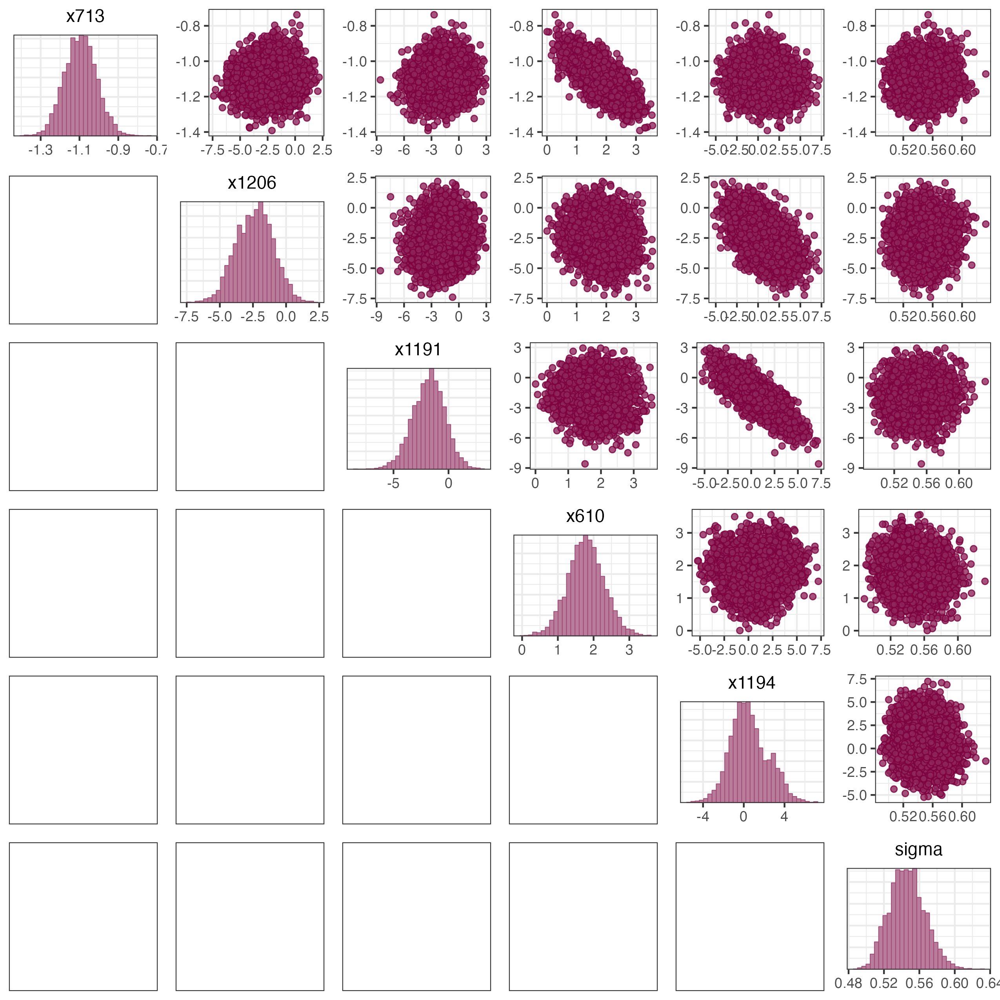

# Finding reduced Bayesian model using predictive projection of the full model

There are various ways to empirically find the reduced model including draw-by-draw approach [@goutisModelChoiceGeneralised1998], [@dupuisVariableSelectionQualitative2003] and the single point approach [@tranPredictiveLasso2012]. Here we use the clustered projection approach by [@juhopiironenProjectiveInferenceHighdimensional2020] which can be thought of as a unification of the above-mentioned approaches and give a nice tradeoff between speed and accuracy.

For the reference and sub-model given in equations @eq-linear_model and @eq-linear_equation_sub_model respectively, minimizing the KL Divergence in @eq-KL-divergence can be done as follows:

1\) Draw M draws of $\{\beta_m, \sigma_m\}_{m = 1}^M$ from the reference model. For each draw, calculate the expected prediction from the reference model for all the training data $\boldsymbol{\tilde{y}}_m = X\beta_m$. Now based on the vectors $\{\boldsymbol{\tilde{y}}_m\}_{m=1}^M$, make $C$ clusters based on k-means algorithm <!--# give citation -->.

2\) Start with null submodel which only includes the intercept term and sequentially add wavelength one by one, selecting the wavelength which leads to the lowest residual sum of squares at each step. This is also called "forward model selection" <!--# give citation -->. For selecting the first wavelength, the forward model selection consists of fitting $p$ regression models (consisting of intercept and one wavelength selected from all input wavelengths) and choosing the submodel which leads to the lowest residual sum of squares. This process is repeated sequentially adding one wavelength at each step until a stopping criterion is achieved . During forward search, a wavelength is selected for a submodel of size k based on the following criterion.

2.a) For a candidate wavelength, For every cluster $I_c$ in step 1, compute $\beta_l = (X_{cand}^{T} X_{cand})^{-1}X_{cand}^T\mu_l$, where $X_{sub}^{cand}$ has the candidate wavelength added to the already selected $k-1$ wavelengths, $\mu_l$ is the averaged prediction over cluster $c_l$, $l = \{1, .., C\}$ i.e. $\mu_l = \frac{1}{|c_l|}\sum_{m \in c_l}X_{all}\beta_{all}^m$. Note that this is the maximum likelihood estimate of $\beta$ for a linear regression model with Gaussian error, but now based on the predictions arising out of the reference model ($\mu_l$) instead of the noisy observations $y$.

2.b) The variance can then be shown to be equal to $\sigma^2_c = \frac{1}{n} \sum_{i = 1}^{n} (\sigma_i^c)^2 + \frac{1}{n} ||X_{sub}\beta_c - \mu_c||^2$, where $\frac{1}{n} \sum_{i = 1}^{n} (\sigma_i^c)^2$ is the predictive variance of the $i^{th}$ prediction $\tilde{y}_i$ within the $c^{th}$ cluster and the second term denotes the variance added due to using the reduced model as opposed to the full model. This is shows that under the above formulation, the predictive variance of the reduced model can never be less than the full model which is helpful to avoid overfitting of the submodels. The choice of number of clusters $C$ can vary between 1 (where all the samples are clustered into 1 cluster) to $M$ (where each sample is assigned its own cluster) with the computational cost increasing as the number of clusters are increased. Choosing a small number of clusters (10-20) has been shown to give good accuracy while being computationally fast. The

2.c) The posterior predictive distribution of a candidate model is then calculated as a weighted sum of the posterior predictive distributions of each cluster$q(\tilde{y}) = \sum_{l = 1}^{C} w_l N(X_{cand}\beta_l, \sigma_l^2)$, where $w_l$ is fixed the fraction of total samples $M$ in cluster $c_l$ or $w_l = \frac{|c_l|}{M}$. We then add the wavelength for which the mean posterior predictive error compared with the observations is the lowest.

3\) For selecting the size (number of wavelengths) of the submodels, we use the validation data (or use cross-validation) to prevent overfitting. We draw posterior predictive samples from both the reference model and the sub models for each model size, and calculate the point estimates and standard errors of the mean squared errors with the validation data. A

of the difference in the squared residuals between the two predictions. We select the final model size if the predictions from submodel is within one standard

<!--# there is a confusion between the terms of \mu for full model and reduced model. I need to work on this. I think \tilde{y}_m and \mu are the same. It will be helpful to have the same notation for the two. -->


# Figures

```{r}
#| echo: FALSE
#source("R_codes/Plotting/posterior_parameter_full_model.R")
```

{#suppfig-posterior_parameters_full_model}

```{r}
#| echo: FALSE
#source("R_codes/Plotting/bivariate_and_marginal_posterior_plots.R")
```

{#fig-bivariate_posterior_parameter}


